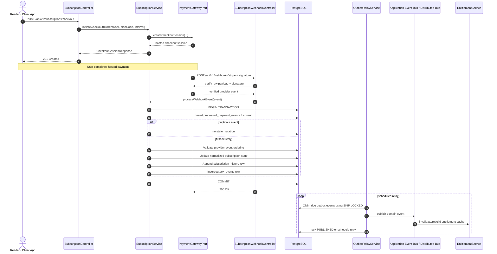
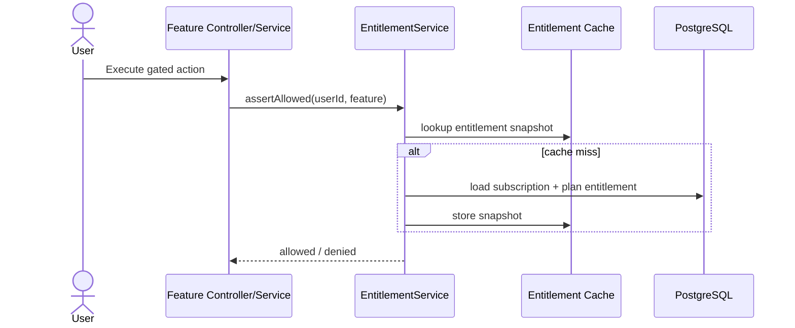

# Ktab Subscription & Entitlement Architecture Blueprint

This document defines the production-grade Subscription & Entitlement architecture for **Ktab-Backend**. The module is self-contained under `com.doova.ktab.features.subscription` and follows Domain-Driven Design (DDD), ports-and-adapters, and the project's Senior Backend Engineering Standards (`.agents/rules/senior-backend.md` and `.agents/rules/packaging-convention.md`).

> **Revision notes (v3 — final).** This revision closes the remaining correctness gaps from v2: quota validation and consumption are now atomic; permission checks are separated from metered consumption; `plan_entitlements` is treated as immutable plan catalog data rather than per-user state; the outbox is explicitly at-least-once with idempotent consumers and retry metadata; multi-instance cache behavior is defined; provider event ordering no longer relies on local `updated_at`; external IDs are provider-scoped; cancellation and plan-change semantics are formalized; checkout redirects are server-controlled; raw webhook payload verification is mandatory; API response codes are consistent; and pricing is normalized into `plan_prices` for future multi-provider support.

---

## 1. Core Architectural Principle: Decouple Billing from Entitlements

The most important architectural rule is that **feature code must never depend directly on Stripe or any payment provider**. Feature modules ask the entitlement layer whether a user may perform an action; they do not inspect provider IDs, subscription objects, or billing state themselves.

```text
┌───────────────────────────────────────────────────────────┐
│                     FEATURE MODULES                       │
│   features.story / features.ocr / features.ai / reader   │
└────────────────────────────┬──────────────────────────────┘
                             │
                             │ Can user perform action?
                             ▼
┌───────────────────────────────────────────────────────────┐
│                   ENTITLEMENT ENGINE                      │
│                                                           │
│  - Boolean feature gates                                  │
│  - Unlimited feature gates                                │
│  - Numeric usage quotas                                   │
│  - Atomic quota consumption                               │
│  - Per-period usage ledger                                │
│  - Cached entitlement snapshots                           │
└────────────────────────────▲──────────────────────────────┘
                             │
                             │ Reads normalized subscription state
                             │ Receives invalidation events
                             ▼
┌───────────────────────────────────────────────────────────┐
│             SUBSCRIPTION MANAGEMENT AGGREGATE             │
│                                                           │
│  - Plans and provider prices                              │
│  - Billing interval / status lifecycle                    │
│  - Grace periods / cancellation                           │
│  - Transactional outbox                                   │
│  - Subscription history                                   │
│  - Provider-event ordering metadata                       │
│  - Reconciliation                                         │
└────────────────────────────▲──────────────────────────────┘
                             │
                             │ Provider-neutral port
                             ▼
┌───────────────────────────────────────────────────────────┐
│                  PAYMENT GATEWAY ADAPTER                  │
│                                                           │
│  Stripe / LemonSqueezy / Paddle / future IAP adapters     │
│  - Checkout / portal / plan change                        │
│  - Raw webhook signature verification                     │
│  - Provider object translation                            │
└───────────────────────────────────────────────────────────┘
```

### Non-negotiable dependency direction

```text
Feature Module
    ↓
EntitlementService
    ↓
Subscription Domain
    ↓
PaymentGatewayPort
    ↓
Provider Adapter
```

No feature module may query Stripe, inspect `external_subscription_id`, or infer access from billing-provider state.

---

## 2. Service Architecture & Runtime Flows

### 2.1 Checkout and webhook flow



The webhook transaction performs **only durable state work**. Cache refreshes, feature notifications, analytics, emails, and other side effects happen asynchronously after the provider has been acknowledged.

### 2.2 Boolean feature-gate flow

Boolean/unlimited access checks do not consume quota.



### 2.3 Numeric quota flow

`assertAllowed()` must **not** consume usage. Metered features call a dedicated atomic quota operation.

Recommended service surface:

```java
public interface EntitlementService {
    void assertAllowed(Long userId, EntitlementFeature feature);

    QuotaConsumptionResult tryConsume(
            Long userId,
            EntitlementFeature feature,
            int units
    );
}
```

`tryConsume(...)` performs the limit check and increment as **one database operation**. There must never be a separate `SELECT used_count` followed by an `UPDATE`.

For simple actions that should count when accepted, consume immediately. For expensive or failure-prone operations, such as long OCR/AI generation, a future reservation API may be introduced:

```text
reserve quota → execute → commit
                     ↘ failure → release
```

Do not introduce reservation complexity until product semantics require it.

---

## 3. Package Layout (`features.subscription`)

```text
com.doova.ktab.features.subscription/
├── config/
│   └── SubscriptionConfig.java
├── controller/
│   ├── SubscriptionController.java
│   ├── SubscriptionWebhookController.java
│   └── admin/
│       └── SubscriptionAdminController.java
├── dto/
│   ├── request/
│   │   ├── CreateCheckoutSessionRequest.java
│   │   ├── ChangePlanRequest.java
│   │   └── AdminOverrideRequest.java
│   └── response/
│       ├── CheckoutSessionResponse.java
│       ├── SubscriptionResponse.java
│       ├── PlanResponse.java
│       ├── PlanPriceResponse.java
│       └── EntitlementStatusResponse.java
├── enums/
│   ├── SubscriptionStatus.java
│   ├── BillingInterval.java
│   ├── PaymentProvider.java
│   ├── EntitlementFeature.java
│   ├── QuotaResetInterval.java
│   ├── OutboxStatus.java
│   └── SubscriptionChangeReason.java
├── event/
│   ├── SubscriptionActivatedEvent.java
│   ├── SubscriptionPlanChangedEvent.java
│   ├── SubscriptionCancellationScheduledEvent.java
│   ├── SubscriptionCanceledEvent.java
│   ├── SubscriptionExpiredEvent.java
│   └── SubscriptionPaymentDisputedEvent.java
├── gateway/
│   ├── PaymentGatewayPort.java
│   ├── PaymentGatewayRegistry.java
│   └── stripe/
│       └── StripeGatewayAdapter.java
├── model/
│   ├── SubscriptionPlan.java
│   ├── PlanPrice.java
│   ├── PlanEntitlement.java
│   ├── UserSubscription.java
│   ├── UserFeatureUsage.java
│   ├── SubscriptionOutboxEvent.java
│   ├── SubscriptionHistoryEntry.java
│   └── ProcessedPaymentEvent.java
├── repository/
│   ├── SubscriptionPlanRepository.java
│   ├── PlanPriceRepository.java
│   ├── PlanEntitlementRepository.java
│   ├── UserSubscriptionRepository.java
│   ├── UserFeatureUsageRepository.java
│   ├── SubscriptionOutboxEventRepository.java
│   ├── SubscriptionHistoryRepository.java
│   └── ProcessedPaymentEventRepository.java
├── service/
│   ├── SubscriptionService.java
│   ├── EntitlementService.java
│   ├── OutboxRelayService.java
│   ├── SubscriptionReconciliationService.java
│   └── impl/
│       ├── SubscriptionServiceImpl.java
│       ├── EntitlementServiceImpl.java
│       ├── OutboxRelayServiceImpl.java
│       └── SubscriptionReconciliationServiceImpl.java
└── listener/
    └── SubscriptionEntitlementListener.java
```

### Service responsibility rules

- Controllers are thin and delegate immediately.
- Transactional lifecycle logic lives in service implementation classes.
- `@Transactional` methods must not rely on self-invocation.
- Provider SDK types never escape the gateway adapter package.
- JPA entities never appear directly in API responses.
- `PlanEntitlement` is catalog configuration and is never mutated for a specific subscriber.
- Per-user usage belongs only in `UserFeatureUsage`.

---

## 4. REST API Definitions

All endpoints are versioned under `/api/v1` through the project's API-versioning convention.

### 4.1 Reader endpoints

| Verb | Path | Auth | Description |
|---|---|---|---|
| GET | `/api/v1/subscriptions/plans` | Public | List active plans, prices, and public entitlement summaries |
| GET | `/api/v1/subscriptions/me` | READER | Current normalized subscription state |
| GET | `/api/v1/subscriptions/entitlements` | READER | Feature gates and quota balances |
| POST | `/api/v1/subscriptions/checkout` | READER | Create hosted checkout session |
| POST | `/api/v1/subscriptions/change-plan` | READER | Upgrade, downgrade, or interval change |
| POST | `/api/v1/subscriptions/portal` | READER | Create provider billing portal session |
| POST | `/api/v1/subscriptions/cancel` | READER | Schedule cancellation at current period end |

### 4.2 Provider webhook

| Verb | Path | Auth | Description |
|---|---|---|---|
| POST | `/api/v1/webhooks/stripe` | Stripe signature | Receives external provider events |

The webhook is intentionally public. It is authenticated cryptographically, not through user JWT authentication or `/internal/**` network rules.

### 4.3 Admin/support endpoint — Phase 5

| Verb | Path | Auth | Description |
|---|---|---|---|
| POST | `/api/v1/admin/subscriptions/{userId}/override` | ADMIN | Temporary comp/manual override with mandatory actor and reason audit |

### 4.4 Checkout redirect rule

Clients must **not** submit arbitrary `successUrl` or `cancelUrl` values. Redirect destinations are server-configured.

If a client needs a post-checkout destination, it may submit a constrained enum such as:

```java
public enum CheckoutReturnTarget {
    BILLING,
    LIBRARY,
    READER
}
```

The backend maps the enum to an allowlisted URL. No arbitrary external redirect URL is accepted.

---

## 5. OpenAPI 3.1 Specification

```yaml
openapi: 3.1.0
info:
  title: Ktab Subscription & Entitlement API
  version: 2.0.0
  description: Subscription lifecycle, billing, plans, and feature entitlement management.

paths:
  /api/v1/subscriptions/plans:
    get:
      summary: Retrieve active subscription plans
      operationId: getActivePlans
      responses:
        '200':
          description: Active plans
          content:
            application/json:
              schema:
                $ref: '#/components/schemas/PlanListResponse'

  /api/v1/subscriptions/me:
    get:
      summary: Get the authenticated user's subscription
      operationId: getMySubscription
      security:
        - BearerAuth: []
      responses:
        '200':
          description: Current normalized subscription
          content:
            application/json:
              schema:
                $ref: '#/components/schemas/SubscriptionResponse'

  /api/v1/subscriptions/entitlements:
    get:
      summary: Get the authenticated user's entitlement snapshot
      operationId: getMyEntitlements
      security:
        - BearerAuth: []
      responses:
        '200':
          description: Feature gates and quota balances
          content:
            application/json:
              schema:
                $ref: '#/components/schemas/EntitlementStatusResponse'

  /api/v1/subscriptions/checkout:
    post:
      summary: Create a hosted checkout session
      operationId: createCheckoutSession
      security:
        - BearerAuth: []
      requestBody:
        required: true
        content:
          application/json:
            schema:
              $ref: '#/components/schemas/CreateCheckoutSessionRequest'
      responses:
        '201':
          description: Checkout session created
          content:
            application/json:
              schema:
                $ref: '#/components/schemas/CheckoutSessionResponse'
        '400':
          description: Invalid plan, interval, or return target
        '409':
          description: Checkout not valid for current subscription state

  /api/v1/subscriptions/change-plan:
    post:
      summary: Change plan or billing interval
      operationId: changePlan
      security:
        - BearerAuth: []
      requestBody:
        required: true
        content:
          application/json:
            schema:
              $ref: '#/components/schemas/ChangePlanRequest'
      responses:
        '200':
          description: Change accepted and normalized state returned
          content:
            application/json:
              schema:
                $ref: '#/components/schemas/SubscriptionResponse'
        '400':
          description: Invalid target plan or interval
        '409':
          description: Change is incompatible with current state

  /api/v1/subscriptions/portal:
    post:
      summary: Create a billing portal session
      operationId: createBillingPortalSession
      security:
        - BearerAuth: []
      responses:
        '201':
          description: Billing portal session created
          content:
            application/json:
              schema:
                $ref: '#/components/schemas/PortalSessionResponse'

  /api/v1/subscriptions/cancel:
    post:
      summary: Schedule cancellation at period end
      operationId: cancelSubscription
      security:
        - BearerAuth: []
      responses:
        '200':
          description: Cancellation scheduled
          content:
            application/json:
              schema:
                $ref: '#/components/schemas/SubscriptionResponse'
        '409':
          description: No cancellable paid subscription exists

  /api/v1/webhooks/stripe:
    post:
      summary: Receive a Stripe webhook
      operationId: handleStripeWebhook
      parameters:
        - in: header
          name: Stripe-Signature
          required: true
          schema:
            type: string
      requestBody:
        required: true
        content:
          application/json:
            schema:
              type: object
              additionalProperties: true
      responses:
        '200':
          description: Event accepted or already processed
        '400':
          description: Invalid payload
        '401':
          description: Invalid or missing provider signature

components:
  securitySchemes:
    BearerAuth:
      type: http
      scheme: bearer
      bearerFormat: JWT

  schemas:
    CreateCheckoutSessionRequest:
      type: object
      required: [planCode, interval]
      properties:
        planCode:
          type: string
          example: PRO_READER
        interval:
          type: string
          enum: [MONTHLY, YEARLY]
        returnTarget:
          type: string
          enum: [BILLING, LIBRARY, READER]
          default: BILLING

    ChangePlanRequest:
      type: object
      required: [planCode, interval]
      properties:
        planCode:
          type: string
          example: PREMIUM_AUTHOR
        interval:
          type: string
          enum: [MONTHLY, YEARLY]

    CheckoutSessionResponse:
      type: object
      required: [checkoutUrl, sessionId, expiresAt]
      properties:
        checkoutUrl:
          type: string
          format: uri
        sessionId:
          type: string
        expiresAt:
          type: string
          format: date-time

    PortalSessionResponse:
      type: object
      required: [portalUrl]
      properties:
        portalUrl:
          type: string
          format: uri

    SubscriptionResponse:
      type: object
      required: [status, planCode, cancelAtPeriodEnd]
      properties:
        status:
          type: string
          enum: [TRIALING, ACTIVE, PAST_DUE, CANCELED, EXPIRED, FREE]
        planCode:
          type: string
        interval:
          type: [string, 'null']
          enum: [MONTHLY, YEARLY, null]
        currentPeriodStart:
          type: [string, 'null']
          format: date-time
        currentPeriodEnd:
          type: [string, 'null']
          format: date-time
        cancelAtPeriodEnd:
          type: boolean
        pendingPlanCode:
          type: [string, 'null']
        pendingInterval:
          type: [string, 'null']
          enum: [MONTHLY, YEARLY, null]

    PlanListResponse:
      type: object
      required: [plans]
      properties:
        plans:
          type: array
          items:
            $ref: '#/components/schemas/PlanResponse'

    PlanResponse:
      type: object
      required: [planCode, displayName, prices]
      properties:
        planCode:
          type: string
        displayName:
          type: string
        description:
          type: [string, 'null']
        prices:
          type: array
          items:
            $ref: '#/components/schemas/PlanPriceResponse'

    PlanPriceResponse:
      type: object
      required: [provider, currency, interval, amount]
      properties:
        provider:
          type: string
        currency:
          type: string
        interval:
          type: string
          enum: [MONTHLY, YEARLY]
        amount:
          type: number

    EntitlementStatusResponse:
      type: object
      required: [features]
      properties:
        features:
          type: array
          items:
            type: object
            required: [featureCode, allowed, unlimited]
            properties:
              featureCode:
                type: string
              allowed:
                type: boolean
              unlimited:
                type: boolean
              quotaLimit:
                type: [integer, 'null']
              used:
                type: [integer, 'null']
              remaining:
                type: [integer, 'null']
              resetsAt:
                type: [string, 'null']
                format: date-time
```

---

## 6. Database Schema Design — Flyway `V8__create_subscription_module.sql`

### Design decisions

- PostgreSQL `NUMERIC` maps to Java `BigDecimal` for money.
- `TIMESTAMPTZ` maps to Java `Instant`.
- Every foreign key used for joins has an index.
- Provider-owned identifiers are unique **within provider scope**, not globally.
- Plan pricing is normalized into `plan_prices` so adding another provider does not require adding provider-specific columns to `subscription_plans`.
- `plan_entitlements` is catalog data shared by all subscribers on a plan.
- `user_feature_usage` is the only per-user usage counter.
- Webhook ordering stores provider-event time separately from local update time.

```sql
-- ============================================================================
-- V8__create_subscription_module.sql
-- ============================================================================

-- 1. Subscription Plans: logical product/tier catalog
CREATE TABLE subscription_plans (
    id              BIGSERIAL PRIMARY KEY,
    plan_code       VARCHAR(50) NOT NULL UNIQUE,
    display_name    VARCHAR(100) NOT NULL,
    description     TEXT,
    is_active       BOOLEAN NOT NULL DEFAULT TRUE,
    created_at      TIMESTAMPTZ NOT NULL DEFAULT NOW(),
    updated_at      TIMESTAMPTZ NOT NULL DEFAULT NOW()
);

-- 2. Provider-specific prices
CREATE TABLE plan_prices (
    id                  BIGSERIAL PRIMARY KEY,
    plan_id             BIGINT NOT NULL REFERENCES subscription_plans(id) ON DELETE CASCADE,
    payment_provider    VARCHAR(30) NOT NULL,
    billing_interval    VARCHAR(20) NOT NULL,
    currency            VARCHAR(3) NOT NULL,
    amount              NUMERIC(10, 2) NOT NULL,
    external_price_id   VARCHAR(150) NOT NULL,
    is_active           BOOLEAN NOT NULL DEFAULT TRUE,
    created_at          TIMESTAMPTZ NOT NULL DEFAULT NOW(),
    updated_at          TIMESTAMPTZ NOT NULL DEFAULT NOW(),
    CONSTRAINT uq_plan_price_scope
        UNIQUE (plan_id, payment_provider, billing_interval, currency),
    CONSTRAINT uq_provider_external_price
        UNIQUE (payment_provider, external_price_id),
    CONSTRAINT ck_plan_price_amount_non_negative
        CHECK (amount >= 0)
);

CREATE INDEX idx_plan_prices_plan_id
    ON plan_prices(plan_id);

CREATE INDEX idx_plan_prices_provider_interval
    ON plan_prices(payment_provider, billing_interval, is_active);

-- 3. Plan entitlements: immutable per-plan feature rules
CREATE TABLE plan_entitlements (
    id                  BIGSERIAL PRIMARY KEY,
    plan_id             BIGINT NOT NULL REFERENCES subscription_plans(id) ON DELETE CASCADE,
    feature_code        VARCHAR(50) NOT NULL,
    is_enabled          BOOLEAN NOT NULL DEFAULT TRUE,
    is_unlimited        BOOLEAN NOT NULL DEFAULT FALSE,
    quota_limit         INTEGER,
    reset_interval      VARCHAR(20) NOT NULL DEFAULT 'NONE',
    created_at          TIMESTAMPTZ NOT NULL DEFAULT NOW(),
    updated_at          TIMESTAMPTZ NOT NULL DEFAULT NOW(),
    CONSTRAINT uq_plan_feature
        UNIQUE (plan_id, feature_code),
    CONSTRAINT ck_plan_entitlement_quota
        CHECK (
            (is_unlimited = TRUE AND quota_limit IS NULL)
            OR
            (is_unlimited = FALSE AND (quota_limit IS NULL OR quota_limit >= 0))
        )
);

CREATE INDEX idx_plan_entitlements_plan_id
    ON plan_entitlements(plan_id);

-- 4. User subscription: one mutable normalized aggregate per user
CREATE TABLE user_subscriptions (
    id                          BIGSERIAL PRIMARY KEY,
    user_id                     BIGINT NOT NULL REFERENCES users(id) ON DELETE RESTRICT,
    plan_id                     BIGINT NOT NULL REFERENCES subscription_plans(id) ON DELETE RESTRICT,
    status                      VARCHAR(30) NOT NULL,
    billing_interval            VARCHAR(20),
    payment_provider            VARCHAR(30),
    external_customer_id        VARCHAR(150),
    external_subscription_id    VARCHAR(150),
    current_period_start        TIMESTAMPTZ,
    current_period_end          TIMESTAMPTZ,
    cancel_at_period_end        BOOLEAN NOT NULL DEFAULT FALSE,
    cancellation_requested_at   TIMESTAMPTZ,
    canceled_at                 TIMESTAMPTZ,
    pending_plan_id             BIGINT REFERENCES subscription_plans(id) ON DELETE RESTRICT,
    pending_billing_interval    VARCHAR(20),
    last_provider_event_at      TIMESTAMPTZ,
    last_provider_event_id      VARCHAR(150),
    version                     BIGINT NOT NULL DEFAULT 0,
    created_at                  TIMESTAMPTZ NOT NULL DEFAULT NOW(),
    updated_at                  TIMESTAMPTZ NOT NULL DEFAULT NOW(),
    CONSTRAINT uq_user_subscription
        UNIQUE (user_id),
    CONSTRAINT uq_provider_subscription
        UNIQUE (payment_provider, external_subscription_id)
);

CREATE INDEX idx_user_subscriptions_user_id
    ON user_subscriptions(user_id);

CREATE INDEX idx_user_subscriptions_plan_id
    ON user_subscriptions(plan_id);

CREATE INDEX idx_user_subscriptions_pending_plan_id
    ON user_subscriptions(pending_plan_id);

CREATE INDEX idx_user_subscriptions_status
    ON user_subscriptions(status);

CREATE INDEX idx_user_subscriptions_provider_customer
    ON user_subscriptions(payment_provider, external_customer_id);

CREATE INDEX idx_user_subscriptions_provider_subscription
    ON user_subscriptions(payment_provider, external_subscription_id);

-- 5. Webhook idempotency ledger
CREATE TABLE processed_payment_events (
    id              BIGSERIAL PRIMARY KEY,
    provider        VARCHAR(30) NOT NULL,
    event_id        VARCHAR(150) NOT NULL,
    event_type      VARCHAR(120) NOT NULL,
    provider_created_at TIMESTAMPTZ,
    processed_at    TIMESTAMPTZ NOT NULL DEFAULT NOW(),
    CONSTRAINT uq_provider_event UNIQUE (provider, event_id)
);

CREATE INDEX idx_processed_payment_events_provider_created
    ON processed_payment_events(provider, processed_at);

-- 6. Usage ledger
CREATE TABLE user_feature_usage (
    id              BIGSERIAL PRIMARY KEY,
    user_id         BIGINT NOT NULL REFERENCES users(id) ON DELETE CASCADE,
    feature_code    VARCHAR(50) NOT NULL,
    period_start    TIMESTAMPTZ NOT NULL,
    period_end      TIMESTAMPTZ NOT NULL,
    used_count      INTEGER NOT NULL DEFAULT 0,
    updated_at      TIMESTAMPTZ NOT NULL DEFAULT NOW(),
    CONSTRAINT uq_user_feature_period
        UNIQUE (user_id, feature_code, period_start),
    CONSTRAINT ck_user_feature_usage_non_negative
        CHECK (used_count >= 0),
    CONSTRAINT ck_user_feature_usage_period
        CHECK (period_end > period_start)
);

CREATE INDEX idx_user_feature_usage_user_id
    ON user_feature_usage(user_id);

CREATE INDEX idx_user_feature_usage_lookup
    ON user_feature_usage(user_id, feature_code, period_start);

-- 7. Transactional outbox
CREATE TABLE outbox_events (
    id                  BIGSERIAL PRIMARY KEY,
    aggregate_type      VARCHAR(50) NOT NULL,
    aggregate_id        BIGINT NOT NULL,
    event_type          VARCHAR(100) NOT NULL,
    payload             JSONB NOT NULL,
    status              VARCHAR(20) NOT NULL DEFAULT 'PENDING',
    retry_count         INTEGER NOT NULL DEFAULT 0,
    next_attempt_at     TIMESTAMPTZ NOT NULL DEFAULT NOW(),
    last_attempt_at     TIMESTAMPTZ,
    last_error          TEXT,
    created_at          TIMESTAMPTZ NOT NULL DEFAULT NOW(),
    published_at        TIMESTAMPTZ,
    CONSTRAINT ck_outbox_retry_non_negative
        CHECK (retry_count >= 0)
);

CREATE INDEX idx_outbox_events_poll
    ON outbox_events(status, next_attempt_at, created_at);

-- 8. Append-only subscription history
CREATE TABLE subscription_history (
    id                      BIGSERIAL PRIMARY KEY,
    user_subscription_id    BIGINT NOT NULL REFERENCES user_subscriptions(id) ON DELETE CASCADE,
    previous_status         VARCHAR(30),
    new_status              VARCHAR(30) NOT NULL,
    previous_plan_id        BIGINT REFERENCES subscription_plans(id) ON DELETE RESTRICT,
    new_plan_id             BIGINT REFERENCES subscription_plans(id) ON DELETE RESTRICT,
    changed_at              TIMESTAMPTZ NOT NULL DEFAULT NOW(),
    reason                  VARCHAR(100) NOT NULL,
    actor_user_id           BIGINT REFERENCES users(id) ON DELETE SET NULL,
    provider_event_id       VARCHAR(150),
    notes                   TEXT
);

CREATE INDEX idx_subscription_history_sub_id
    ON subscription_history(user_subscription_id, changed_at DESC);

CREATE INDEX idx_subscription_history_previous_plan_id
    ON subscription_history(previous_plan_id);

CREATE INDEX idx_subscription_history_new_plan_id
    ON subscription_history(new_plan_id);

CREATE INDEX idx_subscription_history_actor_user_id
    ON subscription_history(actor_user_id);
```

### 6.1 Atomic quota consumption

Quota validation and increment must be atomic.

For an existing usage row:

```sql
UPDATE user_feature_usage
SET used_count = used_count + :units,
    updated_at = NOW()
WHERE user_id = :userId
  AND feature_code = :featureCode
  AND period_start = :periodStart
  AND used_count + :units <= :quotaLimit
RETURNING used_count;
```

For the first use in a period, use an `INSERT ... ON CONFLICT ... DO UPDATE` whose update branch contains the same quota predicate.

Example shape:

```sql
INSERT INTO user_feature_usage (
    user_id,
    feature_code,
    period_start,
    period_end,
    used_count,
    updated_at
)
VALUES (
    :userId,
    :featureCode,
    :periodStart,
    :periodEnd,
    :units,
    NOW()
)
ON CONFLICT (user_id, feature_code, period_start)
DO UPDATE
SET used_count = user_feature_usage.used_count + EXCLUDED.used_count,
    updated_at = NOW()
WHERE user_feature_usage.used_count + EXCLUDED.used_count <= :quotaLimit
RETURNING used_count;
```

Interpretation:

- row returned → quota consumed successfully;
- no row returned → quota exhausted;
- unlimited entitlement → bypass usage ledger entirely unless product analytics require metering.

This removes the race where two concurrent requests both observe remaining capacity and exceed the configured limit.

---

## 7. Event & Messaging Model

### 7.1 Delivery guarantee

The transactional outbox provides **at-least-once delivery**, not exactly-once delivery.

State mutation and outbox insertion occur in the same transaction, so a committed subscription transition always has a durable event. However, a relay may publish an event and crash before marking it `PUBLISHED`; the event will then be delivered again.

Therefore:

> **Every outbox consumer must be idempotent.**

This includes entitlement-cache invalidation, analytics, notification triggers, and any future cross-module consumers.

### 7.2 Event records

```java
package com.doova.ktab.features.subscription.event;

import com.doova.ktab.features.subscription.enums.BillingInterval;
import com.doova.ktab.features.subscription.enums.SubscriptionStatus;
import java.time.Instant;

public record SubscriptionActivatedEvent(
        Long subscriptionId,
        Long userId,
        String planCode,
        SubscriptionStatus status,
        BillingInterval interval,
        Instant currentPeriodEnd,
        String sourceEventId
) {}

public record SubscriptionPlanChangedEvent(
        Long subscriptionId,
        Long userId,
        String previousPlanCode,
        String newPlanCode,
        BillingInterval interval,
        Instant effectiveAt,
        String sourceEventId
) {}

public record SubscriptionCancellationScheduledEvent(
        Long subscriptionId,
        Long userId,
        String planCode,
        Instant currentPeriodEnd,
        String sourceEventId
) {}

public record SubscriptionCanceledEvent(
        Long subscriptionId,
        Long userId,
        String previousPlanCode,
        Instant canceledAt,
        String sourceEventId
) {}

public record SubscriptionExpiredEvent(
        Long subscriptionId,
        Long userId,
        String previousPlanCode,
        Instant expiredAt,
        String sourceEventId
) {}

public record SubscriptionPaymentDisputedEvent(
        Long subscriptionId,
        Long userId,
        String externalChargeId,
        Instant disputedAt,
        String sourceEventId
) {}
```

`sourceEventId` lets downstream consumers de-duplicate provider-originated transitions where necessary.

### 7.3 Outbox relay behavior

`OutboxRelayService` is a scheduled poller.

Claim query concept:

```sql
SELECT *
FROM outbox_events
WHERE status = 'PENDING'
  AND next_attempt_at <= NOW()
ORDER BY created_at
FOR UPDATE SKIP LOCKED
LIMIT :batchSize;
```

Processing rules:

1. claim a small batch in a transaction;
2. publish each event;
3. on success, mark `PUBLISHED` and set `published_at`;
4. on failure, increment `retry_count`, persist `last_error`, and set `next_attempt_at` using bounded exponential backoff;
5. after the maximum retry count, mark `FAILED` and alert operational monitoring;
6. never let one poisoned event block later rows.

At larger scale, the table can be consumed using CDC/Debezium without changing the subscription aggregate's transaction model.

### 7.4 Cache invalidation in single-instance vs. multi-instance deployments

#### Single backend instance

Caffeine plus local `ApplicationEventPublisher` is acceptable.

#### Multiple backend instances

Do **not** rely on local Spring events to invalidate Caffeine caches on every node. Use one of:

- Redis as the shared entitlement cache; or
- Redis Pub/Sub, Kafka, RabbitMQ, or another distributed event mechanism to broadcast cache invalidations.

Recommended default once Ktab runs more than one backend instance:

```text
PostgreSQL outbox
    ↓
relay
    ↓
Redis/Kafka distributed invalidation event
    ↓
all application instances
```

A short cache TTL remains a safety net, not the primary consistency mechanism.

### 7.5 Module behavior

- **OCR (`features.ocr`)**: resolves quota from `plan_entitlements`, then calls `tryConsume(...)` for the number of pages being accepted. It never updates `plan_entitlements` for an individual user.
- **Interactive Story (`features.story`)**: checks the feature gate and atomically consumes story-turn quota if the selected plan is metered.
- **TTS (`features.ai`)**: uses boolean/unlimited feature gates for premium voice availability; no usage row is required unless TTS becomes metered.
- **Entitlement listener**: subscription lifecycle events invalidate or rebuild the user's entitlement snapshot. The listener does not rewrite catalog entitlements.

---

## 8. Subscription State Machine & Plan Changes

### 8.1 State semantics

Recommended statuses:

```text
FREE
TRIALING
ACTIVE
PAST_DUE
CANCELED
EXPIRED
```

`cancel_at_period_end` is an attribute, not a status.

### 8.2 Cancellation lifecycle

```text
ACTIVE
  │
  │ user requests cancellation
  ▼
ACTIVE + cancel_at_period_end = true
  │
  │ access remains available
  │ until current_period_end
  ▼
CANCELED
```

A cancellation request must not set status to `CANCELED` immediately.

`cancellation_requested_at` records intent. `canceled_at` records the time the subscription actually ceases to provide paid access.

### 8.3 Past-due lifecycle

```text
ACTIVE
  ↓ payment fails
PAST_DUE
  ├─ payment recovered → ACTIVE
  └─ grace period/provider termination → EXPIRED or CANCELED
```

The exact grace duration is product configuration, not hard-coded domain behavior. It should be configurable, for example:

```yaml
subscription:
  past-due-grace-period: PT72H
```

### 8.4 Upgrade semantics

Default rule:

> **Upgrades take effect immediately.**

The provider performs proration. After provider confirmation, local `plan_id` and entitlements update immediately and an outbox event invalidates caches.

Example:

```text
FREE → PRO_READER      immediate
PRO_READER → PREMIUM   immediate
MONTHLY → YEARLY       immediate if provider applies immediately
```

### 8.5 Downgrade semantics

Default rule:

> **Downgrades take effect at the next billing boundary.**

Store the requested target in:

```text
pending_plan_id
pending_billing_interval
```

Continue granting the current plan until the provider reports the boundary transition. This prevents users from losing already-paid access early.

### 8.6 Same-plan interval changes

Monthly ↔ yearly behavior is provider-dependent. The gateway adapter returns an effective-time classification:

```java
public enum ChangeEffectiveMode {
    IMMEDIATE,
    PERIOD_END
}
```

The subscription service converts that provider result into normalized current/pending state.

### 8.7 Provider-event ordering

Never compare a provider event timestamp against local `updated_at`.

Use:

```text
last_provider_event_at
last_provider_event_id
```

When an event attempts to move the aggregate backward:

1. compare provider event creation time against `last_provider_event_at`;
2. if older, ignore the stale mutation but still mark the event as processed;
3. for ambiguous provider event families, fetch the current subscription object from the provider and normalize from source-of-truth state rather than trusting event arrival order.

`updated_at` remains a local persistence timestamp only.

---

## 9. Security Layer

### 9.1 Webhook security

Requirements:

- use the provider SDK's official webhook verification mechanism where possible;
- verify `Stripe-Signature` against the **exact raw HTTP request body bytes**;
- do not deserialize and re-serialize JSON before verification;
- reject missing or invalid signatures;
- keep the endpoint public but outside user JWT authentication;
- enforce reasonable request-size limits;
- log event IDs and event types, but never payment secrets or full sensitive payloads.

Conceptual Spring controller shape:

```java
@PostMapping("/api/v1/webhooks/stripe")
public ResponseEntity<Void> handleWebhook(
        @RequestBody byte[] rawBody,
        @RequestHeader("Stripe-Signature") String signature
) {
    VerifiedPaymentEvent event = gateway.verifyWebhook(rawBody, signature);
    subscriptionService.processWebhookEvent(event);
    return ResponseEntity.ok().build();
}
```

### 9.2 Controller boundary

- Never accept `userId` or `subscriptionId` from reader request bodies.
- Resolve the user from authenticated security context.
- Use dedicated DTOs and Bean Validation.
- No JPA entity is serialized directly.
- Return the project's consistent API error envelope.

### 9.3 Redirect safety

- Checkout and portal return URLs are server-configured or enum-mapped.
- Arbitrary client URLs are rejected.
- Never pass untrusted external redirect URLs directly to a payment provider.

### 9.4 Admin overrides

Admin override requirements:

- `ROLE_ADMIN` or stronger;
- mandatory reason;
- acting admin user ID recorded;
- append-only `subscription_history` record;
- event emitted so caches and dependent modules converge;
- optional expiration time for temporary comps.

### 9.5 Data integrity

- `@Version` optimistic locking on `UserSubscription` protects concurrent lifecycle updates.
- Provider event idempotency uses `UNIQUE(provider, event_id)`.
- Provider subscription IDs use `UNIQUE(payment_provider, external_subscription_id)`.
- Quota check + increment is one atomic SQL operation.
- Catalog entitlements are not modified during user subscription activation.

---

## 10. Technology Recommendations & Failure Modes

### 10.1 Recommended technologies

| Concern | Recommendation | Reason |
|---|---|---|
| Primary recurring billing | Stripe Billing | Strong hosted checkout, portal, subscriptions, proration, retries, broad payment support |
| Merchant of Record alternative | LemonSqueezy/Paddle adapter | Useful if tax/MoR requirements later justify it |
| Persistence | PostgreSQL | Transactional state, idempotency ledger, quota atomicity, outbox |
| Single-instance entitlement cache | Caffeine | Very low-latency local reads |
| Multi-instance entitlement cache | Redis | Shared visibility across nodes |
| Event durability | Transactional outbox | Subscription state and event intent commit together |
| High-scale event transport | Kafka / RabbitMQ / Redis Streams / CDC | Cross-node durable or distributed delivery when local events no longer suffice |
| Drift protection | Scheduled reconciliation | Repairs missed or contradictory webhook state |

### 10.2 Semantics that must remain explicit

#### Idempotency

The webhook ledger prevents the same provider event from mutating state more than once.

This is **idempotent processing**, not a claim of universal exactly-once delivery.

#### Outbox

Outbox delivery is at least once. Consumers must tolerate duplicate events.

#### Cache

Cache is an optimization. PostgreSQL normalized subscription state remains authoritative for the backend.

### 10.3 Risk register

| Risk | Impact | Defense |
|---|---:|---|
| Duplicate webhook delivery | Medium | `UNIQUE(provider, event_id)` and duplicate-safe 200 response |
| Out-of-order provider events | Critical | `last_provider_event_at`, stale-event rejection, source-of-truth provider fetch for ambiguous cases |
| Webhook outage / missed events | Critical | Scheduled reconciliation against provider state |
| Concurrent quota requests | Critical | Atomic conditional upsert/update; never read-then-write |
| Feature execution fails after quota charge | Medium | Define consumption semantics per feature; introduce reserve/commit only where required |
| Duplicate outbox delivery | Medium | Idempotent consumers; `sourceEventId` where needed |
| Poisoned outbox event | Medium | Retry metadata, backoff, max retries, FAILED status, alerting |
| Multi-node stale Caffeine cache | High | Redis/shared cache or distributed invalidation bus |
| User cancellation revokes access too early | High | Keep `ACTIVE + cancel_at_period_end=true` until boundary |
| Downgrade revokes paid access early | High | Store pending target and apply at period end |
| Arbitrary checkout redirect | High | Server-owned redirect destinations / strict allowlist |
| Provider ID collision | Low | Provider-scoped unique constraints |
| Local/provider clock semantics mixed | Medium | Compare provider event times only to provider event times |
| Payment failure | High | Configurable `PAST_DUE` grace period plus portal recovery |
| Plan-price migration | Medium | Existing provider price IDs stay pinned until deliberate repricing migration |

### 10.4 Reconciliation strategy

`SubscriptionReconciliationService` should run on a configurable schedule, initially nightly.

For each provider:

1. fetch relevant active/past-due provider subscriptions in pages;
2. compare normalized provider state with `user_subscriptions`;
3. repair drift transactionally;
4. append `subscription_history` with reason `RECONCILIATION`;
5. write outbox events for any effective entitlement change;
6. emit metrics for scanned, matched, repaired, failed.

Do not silently overwrite a newer local/provider event ordering marker with older provider data.

---

## 11. Payment Gateway Port

The port should expose normalized operations instead of leaking Stripe classes.

```java
public interface PaymentGatewayPort {

    PaymentProvider provider();

    CheckoutSessionResult createCheckoutSession(
            CheckoutSessionCommand command
    );

    PortalSessionResult createPortalSession(
            PortalSessionCommand command
    );

    PlanChangeResult changeSubscriptionPlan(
            ChangeSubscriptionPlanCommand command
    );

    CancellationResult cancelAtPeriodEnd(
            CancelSubscriptionCommand command
    );

    VerifiedPaymentEvent verifyWebhook(
            byte[] rawPayload,
            String signature
    );

    ProviderSubscriptionSnapshot getSubscription(
            String externalSubscriptionId
    );

    Page<ProviderSubscriptionSnapshot> listSubscriptions(
            ProviderSubscriptionQuery query
    );
}
```

### IAP note

Apple/Google in-app purchase flows do not map cleanly onto hosted checkout plus HMAC webhooks. When IAP is prioritized, add provider-specific receipt/server-notification ports or extend the gateway abstraction deliberately rather than forcing app-store semantics into Stripe-shaped commands.

---

## 12. Entitlement Service Contract

Recommended domain-facing contract:

```java
public interface EntitlementService {

    EntitlementSnapshot getEntitlements(Long userId);

    boolean isAllowed(
            Long userId,
            EntitlementFeature feature
    );

    void assertAllowed(
            Long userId,
            EntitlementFeature feature
    );

    QuotaConsumptionResult tryConsume(
            Long userId,
            EntitlementFeature feature,
            int units
    );

    void invalidate(Long userId);
}
```

Rules:

- `isAllowed` and `assertAllowed` never consume usage.
- `tryConsume` is used only for numeric quotas.
- A disabled entitlement fails even if usage exists.
- `is_unlimited=true` bypasses quota consumption.
- `quota_limit=null` with `is_unlimited=false` means the feature is boolean-only unless explicitly modeled otherwise.
- `reset_interval=NONE` means no periodic numeric reset.
- period boundaries are computed in one domain component, not independently in every feature module.

### Suggested result

```java
public record QuotaConsumptionResult(
        boolean allowed,
        int consumed,
        Integer limit,
        Integer used,
        Integer remaining,
        Instant resetsAt
) {}
```

---

## 13. Incremental Rollout Plan

### Phase 1 — Foundation

- Add Flyway schema: plans, prices, plan entitlements, user subscription, usage ledger, webhook idempotency, outbox, history.
- Implement entities/repositories.
- Seed `FREE` plan and its entitlements.
- Implement read-only entitlement resolution and fallback to FREE.
- Add:
  - `GET /api/v1/subscriptions/plans`
  - `GET /api/v1/subscriptions/me`
  - `GET /api/v1/subscriptions/entitlements`

> The usage-ledger schema exists in Phase 1, but numeric quota consumption is not wired to product call sites until Phase 4.

### Phase 2 — Stripe checkout and billing portal

- Add Stripe Java SDK.
- Implement `StripeGatewayAdapter`.
- Add checkout, portal, and change-plan commands.
- Server-own all redirect URLs.
- Keep paid activation behind a feature flag until Phase 3 webhook processing is live.

### Phase 3 — Webhooks, lifecycle, outbox

- Implement raw-body Stripe signature verification.
- Handle at minimum:
  - checkout/session completion relevant to subscription creation;
  - invoice payment success/failure;
  - subscription created/updated/deleted;
  - disputes/refunds according to business policy.
- Implement provider-scoped event idempotency.
- Store `last_provider_event_at` / `last_provider_event_id`.
- Append subscription history on every state mutation.
- Implement outbox relay with retries/backoff.
- Formalize cancellation and `PAST_DUE` grace behavior.

### Phase 4 — Feature enforcement

#### 4a. Boolean/unlimited gates

Integrate `assertAllowed(...)` into:

- story/session features;
- OCR entry points;
- book-text/download features;
- premium TTS voice selection.

#### 4b. Numeric quotas

- Implement atomic `tryConsume(...)` using conditional upsert/update.
- Wire quotas into feature call sites.
- Decide consumption timing per feature.
- Add concurrency tests proving quotas cannot exceed limits.

### Phase 5 — Multi-instance and operational hardening

- Implement `SubscriptionReconciliationService`.
- Add admin overrides with full history.
- Use Redis/shared invalidation when running more than one application node.
- Add outbox failure alerts and metrics.
- Add webhook/reconciliation dashboards.
- Add structured subscription-domain audit logging.

### Phase 6 — Additional payment providers / IAP

- Implement provider adapter through `PaymentGatewayPort` where semantics fit.
- Add provider prices to `plan_prices`; do not alter feature modules.
- Scope Apple/Google receipt validation and server notifications as dedicated provider integration work.

---

## 14. Testing Strategy

### Unit tests

- state-transition rules;
- immediate upgrade vs. period-end downgrade;
- cancellation remains active until period end;
- entitlement resolution for FREE/ACTIVE/PAST_DUE/CANCELED;
- quota period calculations;
- provider-event stale/new ordering decisions.

### Repository/integration tests

Use PostgreSQL/Testcontainers for:

- `UNIQUE(provider, event_id)` webhook idempotency;
- provider-scoped external subscription uniqueness;
- atomic quota consumption under concurrency;
- outbox `SKIP LOCKED` multi-worker behavior;
- optimistic-lock conflicts;
- pending downgrade persistence.

### Webhook tests

- valid raw payload/signature;
- invalid signature;
- duplicate event;
- out-of-order event;
- event that updates state and outbox in one commit;
- transaction rollback leaves neither state mutation nor outbox event partially committed.

### Concurrency test: quota invariant

Given quota `50`, fire more than 50 concurrent consumption attempts and assert:

```text
successful consumption count = 50
persisted used_count = 50
used_count never exceeds 50
```

This test is mandatory before numeric quota enforcement is released.

### Outbox delivery test

Simulate:

```text
publish succeeds
process crashes before PUBLISHED update
relay restarts
same event is delivered again
```

Consumer behavior must remain correct after duplicate delivery.

---

## 15. Observability & Operational Requirements

Recommended metrics:

```text
subscription.webhook.received{provider,type}
subscription.webhook.duplicate{provider,type}
subscription.webhook.failed{provider,type}
subscription.webhook.stale_ignored{provider,type}

subscription.outbox.pending
subscription.outbox.failed
subscription.outbox.retry_count
subscription.outbox.publish_latency

subscription.reconciliation.scanned
subscription.reconciliation.repaired
subscription.reconciliation.failed

entitlement.cache.hit
entitlement.cache.miss
entitlement.denied{feature}
entitlement.quota.exhausted{feature}
entitlement.quota.consumed{feature}
```

Alert on:

- sustained webhook failures;
- non-zero FAILED outbox rows;
- reconciliation repair spikes;
- reconciliation job failures;
- unusual duplicate-event volume;
- quota persistence errors.

Do not include PII, card data, secrets, or raw provider payloads in metric labels.

---

## 16. Final Architectural Invariants

The implementation is considered compliant only if all of the following remain true:

1. Feature code depends on `EntitlementService`, never directly on Stripe/provider SDKs.
2. `PlanEntitlement` is shared catalog configuration and is never rewritten per subscriber.
3. Boolean access checks do not consume usage.
4. Numeric quota validation and increment happen atomically in PostgreSQL.
5. Subscription state mutation and outbox insertion commit in the same transaction.
6. Outbox delivery is treated as at least once; all consumers are idempotent.
7. Multi-instance deployments use shared cache or distributed invalidation.
8. Provider event ordering is tracked with provider timestamps/IDs, not local `updated_at`.
9. Provider-owned IDs are unique inside provider scope.
10. Cancellation keeps paid access until `current_period_end`.
11. Upgrades are immediate by default; downgrades are period-end by default.
12. Arbitrary client redirect URLs are never trusted.
13. Webhook signatures are verified against the exact raw request payload.
14. Every state-changing path writes subscription history.
15. Reconciliation can repair missed or divergent provider state.
16. Provider pricing is separated from logical plan identity.

With these invariants, Ktab can evolve from a Stripe-backed subscription MVP into a multi-provider entitlement platform without coupling product features to billing infrastructure or rewriting core access-control logic.
