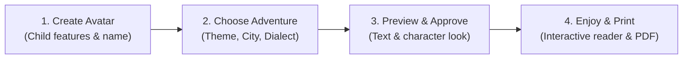

# 📖 Ktab AI Storybook — Client Presentation Brief

### 🌟 Executive Summary
> **"Turn every child into the hero of their own beautifully illustrated Arabic storybook."**

**Ktab AI Storybook** is a personalized publishing engine that crafts custom, culturally authentic children’s books in Arabic. In just a few clicks, parents customize a story tailored specifically to their child’s name, appearance, age, local city, and interests—delivering both an **interactive digital flipbook** and a **print-ready, high-resolution PDF**.

---

### 💡 Why It Stands Out (The Value Proposition)

1. **True Visual Personalization (Consistent Hero):**
   - The child sees themselves on every page (matching skin tone, hairstyle, eye color, glasses, or hijab—or generated from an optional photo).
   - Generates a persistent character reference sheet so the child’s look remains consistent across all scenes.

2. **Authentic Arabic & Cultural Pride:**
   - Available in **Modern Standard Arabic (Fusha)** with optional diacritics (**Tashkeel**) for early readers, or native spoken dialects (**Lebanese, Egyptian, Gulf**).
   - Grounded in real Arab cities and settings (**Beirut, Cairo, Riyadh, Dubai, Amman**, or countryside).

3. **Curated & Safe (Zero "AI Hallucinations"):**
   - Stories are built on vetted narrative **Blueprints** with developmental themes (courage, curiosity, family, empathy, STEM).
   - An automated **Arabic AI Critic** audits grammar, tone, and age-appropriateness before the parent ever sees it.

4. **Parent In-Control (Two Approval Gates):**
   - **Gate 1:** Parents read and approve the story text before illustration starts.
   - **Gate 2:** Parents review and approve the character look before the full book renders.

5. **Privacy by Design:**
   - If a photo is uploaded for likeness, it is encrypted, used strictly to generate the illustration sheet, and **permanently purged** immediately after creation (compliant with Saudi PDPL, UAE PDPL, and GDPR).

---

### 🚀 The 4-Step Customer Experience

1. **Meet the Hero:** The parent sets the child’s name, gender, age band (3–5, 6–8, or 9–10), and customizes their avatar or uploads a photo.
2. **Set the Adventure:** Choose a story theme (e.g., *First Day of School*, *Space Adventure*, *The Young Inventor*), pick the city setting (e.g., Riyadh, Cairo, Beirut), and select 1–3 hobbies (e.g., Football, Space, Drawing).
3. **Review & Approve:** 
   - Within 30 seconds, read the generated story text and approve.
   - Preview the watercolor character illustration and approve.
4. **Delight & Read:** 
   - Instant access to the **Interactive Web/Mobile Reader**.
   - One-click **Print-Ready PDF** with custom dedication page ("To Sami, our brave explorer, with love").

---

### 📦 Deliverables to the End-User

| Deliverable | Description |
| :--- | :--- |
| **Interactive Digital Reader** | Smooth RTL page-turning flipbook with full typography styling optimized for tablets, phones, and web. |
| **Print-Ready Vector PDF** | Formatted with cover art, dedication page, tailored safe-margins, and high-DPI watercolor illustrations ready for home or commercial printing. |
| **Parental Dedication** | A permanent personal keepsake honoring the child’s milestones. |

---

### 💬 Sample Pitch Script to Client

> *"Traditional children's books are one-size-fits-all. With Ktab Storybook, we give Arab parents the superpower to create bespoke books where their own child is the protagonist—learning values in their own dialect, walking through streets that look like their hometown, and engaging in hobbies they actually love. It's not just a story; it's a cherished keepsake that builds a lifelong love for reading in Arabic."*
