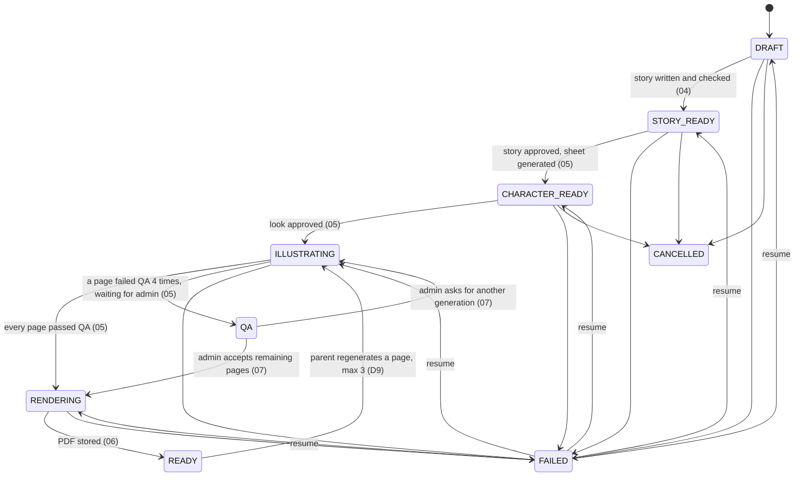

# Storybook 03 — Job Orchestrator Implementation Plan

> **For agentic workers:** REQUIRED SUB-SKILL: Use superpowers:subagent-driven-development (recommended) or superpowers:executing-plans to implement this plan task-by-task. Steps use checkbox (`- [ ]`) syntax for tracking. Read `2026-09-24-storybook-00-overview.md` first — its "Shared contracts" and "Global Constraints" sections apply to every task here.

**Goal:** Drive each book through its steps reliably: a guarded state machine, a Postgres job table with idempotent enqueue and exclusive claiming, retries with backoff, an in-process worker, and resume-from-failure.

**Architecture:** Spec decision "plain job table with workers". Jobs are rows in `tbl_storybook_jobs` (created in sub-plan 02). `JobEnqueuer` inserts with `ON CONFLICT DO NOTHING` on the idempotency key `book:step:page:generation`. `JobClaimer` takes due rows with `SELECT … FOR UPDATE SKIP LOCKED`, so several Ktab instances can poll safely. `JobWorker` runs `StepHandler`s on a bounded executor and hands each result to `JobOutcomeRecorder`, which marks success, schedules a retry with backoff, or kills the job and fails the book. Handlers themselves are written in sub-plans 04–06.

**Tech Stack:** Spring Boot 3.5.7 (`@Scheduled`, `ThreadPoolTaskExecutor`), Spring Data JPA native queries, PostgreSQL, Testcontainers, JUnit 5, Mockito.

**Spec:** `docs/superpowers/specs/2026-09-24-personalized-storybook-spec.md`

## Global Constraints

See the overview. Most relevant here:

- Every step is idempotent, keyed by book + step + page (+ generation, so an intentional regeneration is a new key while a technical retry reuses the old one).
- `FAILED` resumes from the last completed step rather than restarting the book.
- Workers run in-process on their own executor (default 4 threads) and only when `ktab.storybook.enabled=true` (D12).
- Enabling scheduling also activates the dormant `StudioOrphanReconciler` — see overview finding 1.

## Review Focus

Owned by this sub-plan: **#2 two Ktab instances polling the job table at once.** Expected: each job runs on exactly one worker. Test: Task 4, `JobClaimerConcurrencyIT`.

Also here:
- A worker dies mid-job (container killed). Expected: after the lease (10 min) the job returns to `PENDING` and runs again. Test: Task 4, `JobClaimerIT.staleRunningJobsAreReleased`.
- A handler throws an unexpected `RuntimeException` (bug, NPE). Expected: treated as retryable up to `maxAttempts`, then the book goes to `FAILED` with the message recorded — never an infinite loop. Test: Task 6, `JobWorkerTest`.

## State machine



`FAILED` may only return to the status it failed from (`failedFromStatus`). `CANCELLED` is terminal.

## File structure

```
src/main/java/com/doova/ktab/features/storybook/orchestrator/
├── StorybookStateMachine.java        (Task 1)
├── JobEnqueuer.java                  (Task 2)
├── BackoffPolicy.java                (Task 3)
├── JobClaimer.java                   (Task 4)
├── StepOutcome.java  JobOutcomeRecorder.java   (Task 5)
├── StepHandler.java  StepHandlerRegistry.java  JobWorker.java  (Task 6)
└── StorybookResumeService.java       (Task 7)
src/main/java/com/doova/ktab/features/storybook/config/StorybookSchedulingConfig.java (Task 6)
src/main/java/com/doova/ktab/features/storybook/repository/StorybookJobRepository.java (Tasks 2, 4, 7: new queries)
src/main/java/com/doova/ktab/features/storybook/web/StorybookController.java (Task 7: resume endpoint)
```

---

### Task 1: `StorybookStateMachine`

**Files:**
- Create: `src/main/java/com/doova/ktab/features/storybook/orchestrator/StorybookStateMachine.java`
- Test: `src/test/java/com/doova/ktab/features/storybook/orchestrator/StorybookStateMachineTest.java`

**Interfaces:**
- Consumes: `Storybook`, `StorybookStatus` (02), `StorybookStateConflictException`, `ApiMessageKey.STORYBOOK_INVALID_STATE` (02).
- Produces:
  - `void transition(Storybook book, StorybookStatus to)` — throws `StorybookStateConflictException` for a disallowed move. Moving **to** `FAILED` is not allowed through this method (use `fail`). Moving **from** `FAILED` only to `failedFromStatus`, and it clears `failedFromStatus` and `failureReason`.
  - `void fail(Storybook book, String reason)` — records `failedFromStatus = current`, `failureReason = reason` (truncated to 1000 chars), status `FAILED`. No-op if already `FAILED` or `CANCELLED`, or if `READY` (a finished book stays readable; the failure is on the job).
  - `boolean canTransition(StorybookStatus from, StorybookStatus to)`.
- Pure: no Spring beans needed besides being a `@Component`; mutates the entity passed in (caller persists).

- [ ] **Step 1: Write the failing test**

```java
package com.doova.ktab.features.storybook.orchestrator;

import com.doova.ktab.features.storybook.enums.StorybookStatus;
import com.doova.ktab.features.storybook.exception.StorybookStateConflictException;
import com.doova.ktab.features.storybook.model.Storybook;
import org.junit.jupiter.api.Test;
import org.junit.jupiter.params.ParameterizedTest;
import org.junit.jupiter.params.provider.CsvSource;

import static com.doova.ktab.features.storybook.enums.StorybookStatus.*;
import static org.assertj.core.api.Assertions.assertThat;
import static org.assertj.core.api.Assertions.assertThatThrownBy;

class StorybookStateMachineTest {

    private final StorybookStateMachine machine = new StorybookStateMachine();

    private static Storybook book(StorybookStatus status) {
        Storybook b = new Storybook();
        b.setStatus(status);
        return b;
    }

    @ParameterizedTest
    @CsvSource({
            "DRAFT,STORY_READY", "STORY_READY,CHARACTER_READY", "CHARACTER_READY,ILLUSTRATING",
            "ILLUSTRATING,RENDERING", "ILLUSTRATING,QA", "QA,ILLUSTRATING", "QA,RENDERING",
            "RENDERING,READY", "READY,ILLUSTRATING",
            "DRAFT,CANCELLED", "STORY_READY,CANCELLED", "CHARACTER_READY,CANCELLED"
    })
    void allowedTransitions(StorybookStatus from, StorybookStatus to) {
        Storybook b = book(from);
        machine.transition(b, to);
        assertThat(b.getStatus()).isEqualTo(to);
    }

    @ParameterizedTest
    @CsvSource({
            "DRAFT,ILLUSTRATING", "STORY_READY,READY", "READY,DRAFT", "CANCELLED,DRAFT",
            "ILLUSTRATING,CANCELLED", "RENDERING,ILLUSTRATING", "DRAFT,FAILED"
    })
    void disallowedTransitions(StorybookStatus from, StorybookStatus to) {
        assertThatThrownBy(() -> machine.transition(book(from), to))
                .isInstanceOf(StorybookStateConflictException.class);
    }

    @Test
    void failRemembersWhereItFailedAndResumeGoesBackThere() {
        Storybook b = book(ILLUSTRATING);
        machine.fail(b, "image provider down");
        assertThat(b.getStatus()).isEqualTo(FAILED);
        assertThat(b.getFailedFromStatus()).isEqualTo(ILLUSTRATING);
        assertThat(b.getFailureReason()).isEqualTo("image provider down");

        assertThatThrownBy(() -> machine.transition(b, DRAFT)).isInstanceOf(StorybookStateConflictException.class);

        machine.transition(b, ILLUSTRATING);
        assertThat(b.getStatus()).isEqualTo(ILLUSTRATING);
        assertThat(b.getFailedFromStatus()).isNull();
        assertThat(b.getFailureReason()).isNull();
    }

    @Test
    void failDoesNotTouchFinishedOrCancelledBooks() {
        Storybook ready = book(READY);
        machine.fail(ready, "x");
        assertThat(ready.getStatus()).isEqualTo(READY);

        Storybook cancelled = book(CANCELLED);
        machine.fail(cancelled, "x");
        assertThat(cancelled.getStatus()).isEqualTo(CANCELLED);
    }

    @Test
    void failTruncatesLongReasons() {
        Storybook b = book(DRAFT);
        machine.fail(b, "x".repeat(5000));
        assertThat(b.getFailureReason()).hasSize(1000);
    }
}
```

- [ ] **Step 2: Run it to verify it fails**

Run: `./mvnw -q test -Dtest=StorybookStateMachineTest`
Expected: COMPILATION ERROR.

- [ ] **Step 3: Implement**

```java
package com.doova.ktab.features.storybook.orchestrator;

import com.doova.ktab.enums.message.ApiMessageKey;
import com.doova.ktab.features.storybook.enums.StorybookStatus;
import com.doova.ktab.features.storybook.exception.StorybookStateConflictException;
import com.doova.ktab.features.storybook.model.Storybook;
import org.springframework.stereotype.Component;

import java.util.EnumMap;
import java.util.EnumSet;
import java.util.Map;
import java.util.Set;

import static com.doova.ktab.features.storybook.enums.StorybookStatus.*;

@Component
public class StorybookStateMachine {

    private static final Map<StorybookStatus, Set<StorybookStatus>> ALLOWED = new EnumMap<>(StorybookStatus.class);

    static {
        ALLOWED.put(DRAFT, EnumSet.of(STORY_READY, CANCELLED));
        ALLOWED.put(STORY_READY, EnumSet.of(CHARACTER_READY, CANCELLED));
        ALLOWED.put(CHARACTER_READY, EnumSet.of(ILLUSTRATING, CANCELLED));
        ALLOWED.put(ILLUSTRATING, EnumSet.of(RENDERING, QA));
        ALLOWED.put(QA, EnumSet.of(ILLUSTRATING, RENDERING));
        ALLOWED.put(RENDERING, EnumSet.of(READY));
        ALLOWED.put(READY, EnumSet.of(ILLUSTRATING));
        ALLOWED.put(FAILED, EnumSet.noneOf(StorybookStatus.class)); // handled specially
        ALLOWED.put(CANCELLED, EnumSet.noneOf(StorybookStatus.class));
    }

    private static final Set<StorybookStatus> FAILABLE = EnumSet.of(DRAFT, STORY_READY, CHARACTER_READY, ILLUSTRATING, QA, RENDERING);

    public boolean canTransition(StorybookStatus from, StorybookStatus to) {
        return ALLOWED.getOrDefault(from, Set.of()).contains(to);
    }

    public void transition(Storybook book, StorybookStatus to) {
        StorybookStatus from = book.getStatus();
        if (from == FAILED) {
            if (to != book.getFailedFromStatus()) {
                throw new StorybookStateConflictException(ApiMessageKey.STORYBOOK_INVALID_STATE);
            }
            book.setFailedFromStatus(null);
            book.setFailureReason(null);
            book.setStatus(to);
            return;
        }
        if (!canTransition(from, to)) {
            throw new StorybookStateConflictException(ApiMessageKey.STORYBOOK_INVALID_STATE);
        }
        book.setStatus(to);
    }

    public void fail(Storybook book, String reason) {
        if (!FAILABLE.contains(book.getStatus())) {
            return;
        }
        book.setFailedFromStatus(book.getStatus());
        book.setFailureReason(reason == null ? null : reason.substring(0, Math.min(1000, reason.length())));
        book.setStatus(FAILED);
    }
}
```

(`QA` is failable too: an admin-review book can fail if its accepted-page render later breaks.)

- [ ] **Step 4: Run it to verify it passes**

Run: `./mvnw -q test -Dtest=StorybookStateMachineTest`
Expected: 22 tests PASS.

- [ ] **Step 5: Commit**

```bash
git add src/main/java/com/doova/ktab/features/storybook/orchestrator/StorybookStateMachine.java src/test/java/com/doova/ktab/features/storybook/orchestrator/StorybookStateMachineTest.java
git commit -m "feat(storybook): add guarded book state machine with resume-to-last-step"
```

---

### Task 2: `JobEnqueuer` — idempotent enqueue

**Files:**
- Modify: `src/main/java/com/doova/ktab/features/storybook/repository/StorybookJobRepository.java`
- Create: `src/main/java/com/doova/ktab/features/storybook/orchestrator/JobEnqueuer.java`
- Test: `src/test/java/com/doova/ktab/features/storybook/orchestrator/JobEnqueuerIT.java`

**Interfaces:**
- Consumes: `StorybookJobRepository` (02), `JobStep` (02), `StorybookJpaIT`, `StorybookEntityFixtures`, `UserFixtures` (02).
- Produces:
  - `static String JobEnqueuer.key(Long bookId, JobStep step, int pageIndex, int generation)` → `"<bookId>:<STEP>:<pageIndex>:<generation>"`.
  - `boolean JobEnqueuer.enqueue(Long bookId, JobStep step, int pageIndex, int generation)` — `true` if a new row was inserted, `false` if the same key already existed. Book-level steps pass `pageIndex = -1`, `generation = 0`. Joins the caller's transaction (`Propagation.MANDATORY`) so a job is only visible if the state change that caused it commits.
  - Repository: `int insertIfAbsent(Long bookId, String step, int pageIndex, int generation, String key)`.

- [ ] **Step 1: Write the failing test**

```java
package com.doova.ktab.features.storybook.orchestrator;

import com.doova.ktab.features.storybook.enums.JobStatus;
import com.doova.ktab.features.storybook.enums.JobStep;
import com.doova.ktab.features.storybook.model.Storybook;
import com.doova.ktab.features.storybook.repository.StorybookJobRepository;
import com.doova.ktab.features.storybook.support.StorybookEntityFixtures;
import com.doova.ktab.features.storybook.support.StorybookJpaIT;
import com.doova.ktab.features.storybook.support.UserFixtures;
import org.junit.jupiter.api.Test;
import org.springframework.beans.factory.annotation.Autowired;
import org.springframework.context.annotation.Import;

import static org.assertj.core.api.Assertions.assertThat;

@Import(JobEnqueuer.class)
class JobEnqueuerIT extends StorybookJpaIT {

    @Autowired JobEnqueuer enqueuer;
    @Autowired StorybookJobRepository jobs;

    @Test
    void sameKeyIsInsertedOnce() {
        Storybook book = StorybookEntityFixtures.newBook(em, UserFixtures.reader(em, "enq@example.com"));

        assertThat(enqueuer.enqueue(book.getId(), JobStep.ILLUSTRATE_PAGE, 3, 1)).isTrue();
        assertThat(enqueuer.enqueue(book.getId(), JobStep.ILLUSTRATE_PAGE, 3, 1)).isFalse();
        assertThat(enqueuer.enqueue(book.getId(), JobStep.ILLUSTRATE_PAGE, 3, 2)).isTrue();

        assertThat(jobs.findByStorybookIdOrderByIdAsc(book.getId()))
                .extracting(j -> j.getIdempotencyKey() + ":" + j.getStatus())
                .containsExactly(book.getId() + ":ILLUSTRATE_PAGE:3:1:" + JobStatus.PENDING,
                        book.getId() + ":ILLUSTRATE_PAGE:3:2:" + JobStatus.PENDING);
    }

    @Test
    void bookLevelStepsUsePageMinusOne() {
        assertThat(JobEnqueuer.key(9L, JobStep.STORY_PLAN, -1, 0)).isEqualTo("9:STORY_PLAN:-1:0");
    }
}
```

- [ ] **Step 2: Run it to verify it fails**

Run: `./mvnw -q test -Dtest=JobEnqueuerIT`
Expected: COMPILATION ERROR.

- [ ] **Step 3: Add the repository query**

Add to `StorybookJobRepository`:
```java
    @org.springframework.data.jpa.repository.Modifying
    @org.springframework.data.jpa.repository.Query(nativeQuery = true, value = """
            INSERT INTO tbl_storybook_jobs
                (col_storybook_id, col_step, col_page_index, col_generation, col_idempotency_key,
                 col_status, col_attempts, col_next_run_at, created_at, updated_at, version)
            VALUES (:bookId, :step, :pageIndex, :generation, :key, 'PENDING', 0, now(), now(), now(), 0)
            ON CONFLICT (col_idempotency_key) DO NOTHING
            """)
    int insertIfAbsent(@org.springframework.data.repository.query.Param("bookId") Long bookId,
                       @org.springframework.data.repository.query.Param("step") String step,
                       @org.springframework.data.repository.query.Param("pageIndex") int pageIndex,
                       @org.springframework.data.repository.query.Param("generation") int generation,
                       @org.springframework.data.repository.query.Param("key") String key);
```

- [ ] **Step 4: Implement `JobEnqueuer`**

```java
package com.doova.ktab.features.storybook.orchestrator;

import com.doova.ktab.features.storybook.enums.JobStep;
import com.doova.ktab.features.storybook.repository.StorybookJobRepository;
import lombok.RequiredArgsConstructor;
import org.springframework.stereotype.Component;
import org.springframework.transaction.annotation.Propagation;
import org.springframework.transaction.annotation.Transactional;

@Component
@RequiredArgsConstructor
public class JobEnqueuer {

    private final StorybookJobRepository jobs;

    public static String key(Long bookId, JobStep step, int pageIndex, int generation) {
        return bookId + ":" + step.name() + ":" + pageIndex + ":" + generation;
    }

    /** Must run inside the transaction that made the state change this job follows from. */
    @Transactional(propagation = Propagation.MANDATORY)
    public boolean enqueue(Long bookId, JobStep step, int pageIndex, int generation) {
        return jobs.insertIfAbsent(bookId, step.name(), pageIndex, generation,
                key(bookId, step, pageIndex, generation)) == 1;
    }
}
```

`@DataJpaTest` runs each test in a transaction, so `MANDATORY` is satisfied there.

- [ ] **Step 5: Run it to verify it passes**

Run: `./mvnw -q test -Dtest=JobEnqueuerIT`
Expected: 2 tests PASS.

- [ ] **Step 6: Commit**

```bash
git add src/main/java/com/doova/ktab/features/storybook/orchestrator/JobEnqueuer.java src/main/java/com/doova/ktab/features/storybook/repository/StorybookJobRepository.java src/test/java/com/doova/ktab/features/storybook/orchestrator/JobEnqueuerIT.java
git commit -m "feat(storybook): add idempotent job enqueue keyed by book, step, page and generation"
```

---

### Task 3: `BackoffPolicy`

**Files:**
- Create: `src/main/java/com/doova/ktab/features/storybook/orchestrator/BackoffPolicy.java`
- Test: `src/test/java/com/doova/ktab/features/storybook/orchestrator/BackoffPolicyTest.java`

**Interfaces:**
- Consumes: `StorybookProperties.getWorker().getBaseBackoff()` (01).
- Produces: `Duration delayAfter(int attempts)` — exponential (`base × 2^(attempts-1)`), capped at 30 minutes, with "equal jitter" (half fixed + random half). Constructor `BackoffPolicy(StorybookProperties p, DoubleSupplier random)`; the Spring constructor uses `ThreadLocalRandom`.

- [ ] **Step 1: Write the failing test**

```java
package com.doova.ktab.features.storybook.orchestrator;

import com.doova.ktab.features.storybook.config.StorybookProperties;
import org.junit.jupiter.api.Test;

import java.time.Duration;

import static org.assertj.core.api.Assertions.assertThat;

class BackoffPolicyTest {

    private final StorybookProperties props = new StorybookProperties(); // base 10s

    @Test
    void growsExponentiallyWithJitterBounds() {
        BackoffPolicy low = new BackoffPolicy(props, () -> 0.0);
        BackoffPolicy high = new BackoffPolicy(props, () -> 1.0);

        assertThat(low.delayAfter(1)).isEqualTo(Duration.ofSeconds(5));
        assertThat(high.delayAfter(1)).isEqualTo(Duration.ofSeconds(10));
        assertThat(low.delayAfter(3)).isEqualTo(Duration.ofSeconds(20));
        assertThat(high.delayAfter(3)).isEqualTo(Duration.ofSeconds(40));
    }

    @Test
    void isCappedAtThirtyMinutes() {
        assertThat(new BackoffPolicy(props, () -> 1.0).delayAfter(40)).isEqualTo(Duration.ofMinutes(30));
    }
}
```

- [ ] **Step 2: Run it to verify it fails**

Run: `./mvnw -q test -Dtest=BackoffPolicyTest`
Expected: COMPILATION ERROR.

- [ ] **Step 3: Implement**

```java
package com.doova.ktab.features.storybook.orchestrator;

import com.doova.ktab.features.storybook.config.StorybookProperties;
import org.springframework.beans.factory.annotation.Autowired;
import org.springframework.stereotype.Component;

import java.time.Duration;
import java.util.concurrent.ThreadLocalRandom;
import java.util.function.DoubleSupplier;

@Component
public class BackoffPolicy {

    private static final Duration CAP = Duration.ofMinutes(30);

    private final Duration base;
    private final DoubleSupplier random;

    @Autowired
    public BackoffPolicy(StorybookProperties properties) {
        this(properties, () -> ThreadLocalRandom.current().nextDouble());
    }

    public BackoffPolicy(StorybookProperties properties, DoubleSupplier random) {
        this.base = properties.getWorker().getBaseBackoff();
        this.random = random;
    }

    public Duration delayAfter(int attempts) {
        int exponent = Math.min(Math.max(attempts, 1) - 1, 20);
        long millis = Math.min(base.toMillis() * (1L << exponent), CAP.toMillis());
        long half = millis / 2;
        return Duration.ofMillis(half + Math.round(half * random.getAsDouble()));
    }
}
```

- [ ] **Step 4: Run it to verify it passes**

Run: `./mvnw -q test -Dtest=BackoffPolicyTest`
Expected: 2 tests PASS.

- [ ] **Step 5: Commit**

```bash
git add src/main/java/com/doova/ktab/features/storybook/orchestrator/BackoffPolicy.java src/test/java/com/doova/ktab/features/storybook/orchestrator/BackoffPolicyTest.java
git commit -m "feat(storybook): add capped exponential backoff with jitter"
```

---

### Task 4: `JobClaimer` — exclusive claiming and stale-lock release

**Files:**
- Modify: `src/main/java/com/doova/ktab/features/storybook/repository/StorybookJobRepository.java`
- Create: `src/main/java/com/doova/ktab/features/storybook/orchestrator/JobClaimer.java`
- Test: `src/test/java/com/doova/ktab/features/storybook/orchestrator/JobClaimerIT.java`, `JobClaimerConcurrencyIT.java`

**Interfaces:**
- Consumes: `StorybookJobRepository` (02, Task 2), `JobEnqueuer` (Task 2), fixtures (02).
- Produces:
  - `List<StorybookJob> claim(String workerId, int limit)` — `@Transactional`; atomically moves up to `limit` due `PENDING` jobs (`col_next_run_at <= now()`, oldest first) to `RUNNING`, sets `locked_by`, `locked_at`, increments `attempts`, and returns them. Rows locked by another in-flight claim are skipped, never waited on.
  - `int releaseStale(Duration lease)` — `@Transactional`; `RUNNING` jobs whose `locked_at` is older than `lease` go back to `PENDING` (attempts unchanged, so a crash counts as an attempt).
  - Repository: `List<Long> lockDueJobIds(int limit)`, `int markRunning(List<Long> ids, String workerId)`, `int releaseStaleRunning(Instant lockedBefore)`.

- [ ] **Step 1: Write the failing tests**

`JobClaimerIT.java`:
```java
package com.doova.ktab.features.storybook.orchestrator;

import com.doova.ktab.features.storybook.enums.JobStatus;
import com.doova.ktab.features.storybook.enums.JobStep;
import com.doova.ktab.features.storybook.model.Storybook;
import com.doova.ktab.features.storybook.model.StorybookJob;
import com.doova.ktab.features.storybook.repository.StorybookJobRepository;
import com.doova.ktab.features.storybook.support.StorybookEntityFixtures;
import com.doova.ktab.features.storybook.support.StorybookJpaIT;
import com.doova.ktab.features.storybook.support.UserFixtures;
import org.junit.jupiter.api.Test;
import org.springframework.beans.factory.annotation.Autowired;
import org.springframework.context.annotation.Import;

import java.time.Duration;
import java.time.Instant;
import java.util.List;

import static org.assertj.core.api.Assertions.assertThat;

@Import({JobClaimer.class, JobEnqueuer.class})
class JobClaimerIT extends StorybookJpaIT {

    @Autowired JobClaimer claimer;
    @Autowired JobEnqueuer enqueuer;
    @Autowired StorybookJobRepository jobs;

    @Test
    void claimsDueJobsOldestFirstAndMarksThemRunning() {
        Storybook book = StorybookEntityFixtures.newBook(em, UserFixtures.reader(em, "claim@example.com"));
        enqueuer.enqueue(book.getId(), JobStep.ILLUSTRATE_PAGE, 1, 1);
        enqueuer.enqueue(book.getId(), JobStep.ILLUSTRATE_PAGE, 2, 1);
        enqueuer.enqueue(book.getId(), JobStep.ILLUSTRATE_PAGE, 3, 1);
        em.clear();

        List<StorybookJob> claimed = claimer.claim("worker-a", 2);

        assertThat(claimed).hasSize(2).allSatisfy(j -> {
            assertThat(j.getStatus()).isEqualTo(JobStatus.RUNNING);
            assertThat(j.getLockedBy()).isEqualTo("worker-a");
            assertThat(j.getAttempts()).isEqualTo(1);
        });
        assertThat(claimer.claim("worker-a", 10)).hasSize(1);
        assertThat(claimer.claim("worker-a", 10)).isEmpty();
    }

    @Test
    void futureJobsAreNotClaimed() {
        Storybook book = StorybookEntityFixtures.newBook(em, UserFixtures.reader(em, "future@example.com"));
        enqueuer.enqueue(book.getId(), JobStep.STORY_PLAN, -1, 0);
        StorybookJob job = jobs.findByStorybookIdOrderByIdAsc(book.getId()).get(0);
        job.setNextRunAt(Instant.now().plus(Duration.ofHours(1)));
        em.flush();
        em.clear();

        assertThat(claimer.claim("w", 10)).isEmpty();
    }

    @Test
    void staleRunningJobsAreReleased() {
        Storybook book = StorybookEntityFixtures.newBook(em, UserFixtures.reader(em, "stale@example.com"));
        enqueuer.enqueue(book.getId(), JobStep.STORY_PLAN, -1, 0);
        em.clear();
        StorybookJob job = claimer.claim("dead-worker", 1).get(0);
        em.getEntityManager().createNativeQuery(
                "update tbl_storybook_jobs set col_locked_at = now() - interval '20 minutes' where col_id = :id")
                .setParameter("id", job.getId()).executeUpdate();
        em.clear();

        assertThat(claimer.releaseStale(Duration.ofMinutes(10))).isEqualTo(1);
        StorybookJob released = jobs.findById(job.getId()).orElseThrow();
        assertThat(released.getStatus()).isEqualTo(JobStatus.PENDING);
        assertThat(released.getLockedBy()).isNull();
        assertThat(released.getAttempts()).isEqualTo(1);
    }
}
```

`JobClaimerConcurrencyIT.java` (Review Focus #2 — needs committed rows and two real transactions):
```java
package com.doova.ktab.features.storybook.orchestrator;

import com.doova.ktab.features.storybook.enums.JobStep;
import com.doova.ktab.features.storybook.model.Storybook;
import com.doova.ktab.features.storybook.model.StorybookJob;
import com.doova.ktab.features.storybook.support.StorybookEntityFixtures;
import com.doova.ktab.features.storybook.support.StorybookJpaIT;
import com.doova.ktab.features.storybook.support.UserFixtures;
import org.junit.jupiter.api.Test;
import org.springframework.beans.factory.annotation.Autowired;
import org.springframework.context.annotation.Import;
import org.springframework.transaction.PlatformTransactionManager;
import org.springframework.transaction.annotation.Propagation;
import org.springframework.transaction.annotation.Transactional;
import org.springframework.transaction.support.TransactionTemplate;

import java.util.HashSet;
import java.util.List;
import java.util.Set;
import java.util.concurrent.CountDownLatch;
import java.util.concurrent.ExecutorService;
import java.util.concurrent.Executors;
import java.util.concurrent.Future;

import static org.assertj.core.api.Assertions.assertThat;

@Import({JobClaimer.class, JobEnqueuer.class})
@Transactional(propagation = Propagation.NOT_SUPPORTED)
class JobClaimerConcurrencyIT extends StorybookJpaIT {

    @Autowired JobClaimer claimer;
    @Autowired JobEnqueuer enqueuer;
    @Autowired PlatformTransactionManager txManager;

    @Test
    void twoWorkersNeverClaimTheSameJob() throws Exception {
        TransactionTemplate tx = new TransactionTemplate(txManager);
        tx.executeWithoutResult(s -> {
            Storybook book = StorybookEntityFixtures.newBook(em, UserFixtures.reader(em, "race-" + System.nanoTime() + "@example.com"));
            for (int page = 1; page <= 40; page++) {
                enqueuer.enqueue(book.getId(), JobStep.ILLUSTRATE_PAGE, page, 1);
            }
        });

        ExecutorService pool = Executors.newFixedThreadPool(2);
        CountDownLatch start = new CountDownLatch(1);
        List<Future<Set<Long>>> results = List.of(
                pool.submit(() -> drain(start, "worker-a")),
                pool.submit(() -> drain(start, "worker-b")));
        start.countDown();
        Set<Long> a = results.get(0).get();
        Set<Long> b = results.get(1).get();
        pool.shutdown();

        assertThat(a).doesNotContainAnyElementsOf(b);
        assertThat(a.size() + b.size()).isEqualTo(40);
    }

    private Set<Long> drain(CountDownLatch start, String worker) throws InterruptedException {
        start.await();
        Set<Long> ids = new HashSet<>();
        List<StorybookJob> batch;
        do {
            batch = claimer.claim(worker, 3);
            batch.forEach(j -> ids.add(j.getId()));
        } while (!batch.isEmpty());
        return ids;
    }
}
```

This test leaves committed rows in the shared container; other tests only look at their own book ids, so that is harmless.

- [ ] **Step 2: Run them to verify they fail**

Run: `./mvnw -q test -Dtest='JobClaimerIT,JobClaimerConcurrencyIT'`
Expected: COMPILATION ERROR.

- [ ] **Step 3: Add the repository queries**

Add to `StorybookJobRepository` (add the imports `org.springframework.data.jpa.repository.Modifying`, `org.springframework.data.jpa.repository.Query`, `org.springframework.data.repository.query.Param`, `java.time.Instant`):
```java
    @Query(nativeQuery = true, value = """
            SELECT col_id FROM tbl_storybook_jobs
            WHERE col_status = 'PENDING' AND col_next_run_at <= now()
            ORDER BY col_next_run_at, col_id
            LIMIT :limit
            FOR UPDATE SKIP LOCKED
            """)
    List<Long> lockDueJobIds(@Param("limit") int limit);

    @Modifying
    @Query(nativeQuery = true, value = """
            UPDATE tbl_storybook_jobs
            SET col_status = 'RUNNING', col_locked_by = :worker, col_locked_at = now(),
                col_attempts = col_attempts + 1, updated_at = now(), version = version + 1
            WHERE col_id IN (:ids)
            """)
    int markRunning(@Param("ids") List<Long> ids, @Param("worker") String worker);

    @Modifying
    @Query(nativeQuery = true, value = """
            UPDATE tbl_storybook_jobs
            SET col_status = 'PENDING', col_locked_by = NULL, col_locked_at = NULL,
                updated_at = now(), version = version + 1
            WHERE col_status = 'RUNNING' AND col_locked_at < :lockedBefore
            """)
    int releaseStaleRunning(@Param("lockedBefore") Instant lockedBefore);
```

- [ ] **Step 4: Implement `JobClaimer`**

```java
package com.doova.ktab.features.storybook.orchestrator;

import com.doova.ktab.features.storybook.model.StorybookJob;
import com.doova.ktab.features.storybook.repository.StorybookJobRepository;
import jakarta.persistence.EntityManager;
import lombok.RequiredArgsConstructor;
import org.springframework.stereotype.Component;
import org.springframework.transaction.annotation.Transactional;

import java.time.Duration;
import java.time.Instant;
import java.util.List;

@Component
@RequiredArgsConstructor
public class JobClaimer {

    private final StorybookJobRepository jobs;
    private final EntityManager entityManager;

    /**
     * The SELECT ... FOR UPDATE SKIP LOCKED and the UPDATE run in one transaction, so the row
     * locks are held until the RUNNING state is committed; a concurrent claimer skips them.
     */
    @Transactional
    public List<StorybookJob> claim(String workerId, int limit) {
        if (limit <= 0) {
            return List.of();
        }
        List<Long> ids = jobs.lockDueJobIds(limit);
        if (ids.isEmpty()) {
            return List.of();
        }
        jobs.markRunning(ids, workerId);
        entityManager.flush();
        entityManager.clear(); // re-read the rows as updated by the native query
        return jobs.findAllById(ids);
    }

    @Transactional
    public int releaseStale(Duration lease) {
        return jobs.releaseStaleRunning(Instant.now().minus(lease));
    }
}
```

`findAllById` does not guarantee order; callers do not rely on it.

- [ ] **Step 5: Run the tests to verify they pass**

Run: `./mvnw -q test -Dtest='JobClaimerIT,JobClaimerConcurrencyIT'`
Expected: 4 tests PASS. If `JobClaimerConcurrencyIT` ever shows overlap, the claim is not running in one transaction — check that `JobClaimer` is a Spring proxy (called through the bean, not `this`).

- [ ] **Step 6: Commit**

```bash
git add src/main/java/com/doova/ktab/features/storybook/orchestrator/JobClaimer.java src/main/java/com/doova/ktab/features/storybook/repository/StorybookJobRepository.java src/test/java/com/doova/ktab/features/storybook/orchestrator
git commit -m "feat(storybook): add SKIP LOCKED job claiming and stale-lock release"
```

---

### Task 5: `StepOutcome` and `JobOutcomeRecorder`

**Files:**
- Create: `src/main/java/com/doova/ktab/features/storybook/orchestrator/StepOutcome.java`, `JobOutcomeRecorder.java`
- Test: `src/test/java/com/doova/ktab/features/storybook/orchestrator/JobOutcomeRecorderTest.java`

**Interfaces:**
- Consumes: `StorybookJobRepository`, `StorybookRepository` (02), `StorybookStateMachine` (Task 1), `BackoffPolicy` (Task 3), `StorybookProperties.getWorker().getMaxAttempts()` (01).
- Produces:
  - `record StepOutcome(Type type, String reason)` with `enum Type { SUCCESS, RETRY, FAIL }` and factories `success()`, `retry(String reason)`, `fail(String reason)`.
  - `JobOutcomeRecorder.record(Long jobId, StepOutcome outcome)` — `@Transactional`:
    - `SUCCESS` → job `SUCCEEDED`, `finishedAt = now`, lock cleared.
    - `RETRY` and `attempts < maxAttempts` → `PENDING`, `nextRunAt = now + backoff(attempts)`, `lastError = reason`, lock cleared.
    - `RETRY` at `maxAttempts`, or `FAIL` → job `DEAD`, `lastError`, `finishedAt`; the book goes to `FAILED` via `StorybookStateMachine.fail(book, "<STEP> failed: <reason>")`.

- [ ] **Step 1: Write the failing test**

```java
package com.doova.ktab.features.storybook.orchestrator;

import com.doova.ktab.features.storybook.config.StorybookProperties;
import com.doova.ktab.features.storybook.enums.JobStatus;
import com.doova.ktab.features.storybook.enums.JobStep;
import com.doova.ktab.features.storybook.enums.StorybookStatus;
import com.doova.ktab.features.storybook.model.Storybook;
import com.doova.ktab.features.storybook.model.StorybookJob;
import com.doova.ktab.features.storybook.repository.StorybookJobRepository;
import com.doova.ktab.features.storybook.repository.StorybookRepository;
import org.junit.jupiter.api.BeforeEach;
import org.junit.jupiter.api.Test;

import java.time.Duration;
import java.time.Instant;
import java.util.Optional;

import static org.assertj.core.api.Assertions.assertThat;
import static org.mockito.Mockito.mock;
import static org.mockito.Mockito.when;

class JobOutcomeRecorderTest {

    private final StorybookJobRepository jobs = mock(StorybookJobRepository.class);
    private final StorybookRepository books = mock(StorybookRepository.class);
    private final StorybookProperties props = new StorybookProperties(); // maxAttempts 5
    private final JobOutcomeRecorder recorder = new JobOutcomeRecorder(jobs, books, new StorybookStateMachine(),
            new BackoffPolicy(props, () -> 1.0), props);

    private StorybookJob job;
    private Storybook book;

    @BeforeEach
    void setUp() {
        job = new StorybookJob();
        job.setId(1L);
        job.setStorybookId(10L);
        job.setStep(JobStep.ILLUSTRATE_PAGE);
        job.setStatus(JobStatus.RUNNING);
        job.setLockedBy("w");
        book = new Storybook();
        book.setStatus(StorybookStatus.ILLUSTRATING);
        when(jobs.findById(1L)).thenReturn(Optional.of(job));
        when(books.findById(10L)).thenReturn(Optional.of(book));
    }

    @Test
    void successFinishesTheJob() {
        recorder.record(1L, StepOutcome.success());
        assertThat(job.getStatus()).isEqualTo(JobStatus.SUCCEEDED);
        assertThat(job.getFinishedAt()).isNotNull();
        assertThat(job.getLockedBy()).isNull();
    }

    @Test
    void retryReschedulesWithBackoff() {
        job.setAttempts(2);
        Instant before = Instant.now();
        recorder.record(1L, StepOutcome.retry("HTTP 503"));
        assertThat(job.getStatus()).isEqualTo(JobStatus.PENDING);
        assertThat(job.getLastError()).isEqualTo("HTTP 503");
        assertThat(job.getNextRunAt()).isAfterOrEqualTo(before.plus(Duration.ofSeconds(20)));
        assertThat(book.getStatus()).isEqualTo(StorybookStatus.ILLUSTRATING);
    }

    @Test
    void retryAtTheLimitKillsTheJobAndFailsTheBook() {
        job.setAttempts(5);
        recorder.record(1L, StepOutcome.retry("HTTP 503"));
        assertThat(job.getStatus()).isEqualTo(JobStatus.DEAD);
        assertThat(book.getStatus()).isEqualTo(StorybookStatus.FAILED);
        assertThat(book.getFailedFromStatus()).isEqualTo(StorybookStatus.ILLUSTRATING);
        assertThat(book.getFailureReason()).contains("ILLUSTRATE_PAGE").contains("HTTP 503");
    }

    @Test
    void failIsImmediate() {
        job.setAttempts(1);
        recorder.record(1L, StepOutcome.fail("refused"));
        assertThat(job.getStatus()).isEqualTo(JobStatus.DEAD);
        assertThat(book.getStatus()).isEqualTo(StorybookStatus.FAILED);
    }
}
```

- [ ] **Step 2: Run it to verify it fails**

Run: `./mvnw -q test -Dtest=JobOutcomeRecorderTest`
Expected: COMPILATION ERROR.

- [ ] **Step 3: Implement**

`StepOutcome.java`:
```java
package com.doova.ktab.features.storybook.orchestrator;

public record StepOutcome(Type type, String reason) {

    public enum Type { SUCCESS, RETRY, FAIL }

    public static StepOutcome success() {
        return new StepOutcome(Type.SUCCESS, null);
    }

    public static StepOutcome retry(String reason) {
        return new StepOutcome(Type.RETRY, reason);
    }

    public static StepOutcome fail(String reason) {
        return new StepOutcome(Type.FAIL, reason);
    }
}
```

`JobOutcomeRecorder.java`:
```java
package com.doova.ktab.features.storybook.orchestrator;

import com.doova.ktab.features.storybook.config.StorybookProperties;
import com.doova.ktab.features.storybook.enums.JobStatus;
import com.doova.ktab.features.storybook.model.StorybookJob;
import com.doova.ktab.features.storybook.repository.StorybookJobRepository;
import com.doova.ktab.features.storybook.repository.StorybookRepository;
import lombok.RequiredArgsConstructor;
import lombok.extern.slf4j.Slf4j;
import org.springframework.stereotype.Component;
import org.springframework.transaction.annotation.Transactional;

import java.time.Instant;

@Component
@RequiredArgsConstructor
@Slf4j
public class JobOutcomeRecorder {

    private final StorybookJobRepository jobs;
    private final StorybookRepository books;
    private final StorybookStateMachine stateMachine;
    private final BackoffPolicy backoff;
    private final StorybookProperties properties;

    @Transactional
    public void record(Long jobId, StepOutcome outcome) {
        StorybookJob job = jobs.findById(jobId).orElseThrow();
        job.setLockedBy(null);
        job.setLockedAt(null);
        switch (outcome.type()) {
            case SUCCESS -> {
                job.setStatus(JobStatus.SUCCEEDED);
                job.setFinishedAt(Instant.now());
                job.setLastError(null);
            }
            case RETRY -> {
                if (job.getAttempts() < properties.getWorker().getMaxAttempts()) {
                    job.setStatus(JobStatus.PENDING);
                    job.setNextRunAt(Instant.now().plus(backoff.delayAfter(job.getAttempts())));
                    job.setLastError(outcome.reason());
                } else {
                    kill(job, outcome.reason());
                }
            }
            case FAIL -> kill(job, outcome.reason());
        }
    }

    private void kill(StorybookJob job, String reason) {
        job.setStatus(JobStatus.DEAD);
        job.setFinishedAt(Instant.now());
        job.setLastError(reason);
        log.warn("storybook job {} ({}) for book {} is dead: {}", job.getId(), job.getStep(), job.getStorybookId(), reason);
        books.findById(job.getStorybookId())
                .ifPresent(book -> stateMachine.fail(book, job.getStep() + " failed: " + reason));
    }
}
```

- [ ] **Step 4: Run it to verify it passes**

Run: `./mvnw -q test -Dtest=JobOutcomeRecorderTest`
Expected: 4 tests PASS.

- [ ] **Step 5: Commit**

```bash
git add src/main/java/com/doova/ktab/features/storybook/orchestrator/StepOutcome.java src/main/java/com/doova/ktab/features/storybook/orchestrator/JobOutcomeRecorder.java src/test/java/com/doova/ktab/features/storybook/orchestrator/JobOutcomeRecorderTest.java
git commit -m "feat(storybook): record job outcomes with retry, dead-letter and book failure"
```

---

### Task 6: `StepHandler`, registry, worker and scheduling config

**Files:**
- Create: `src/main/java/com/doova/ktab/features/storybook/orchestrator/StepHandler.java`, `StepHandlerRegistry.java`, `JobWorker.java`
- Create: `src/main/java/com/doova/ktab/features/storybook/config/StorybookSchedulingConfig.java`
- Test: `src/test/java/com/doova/ktab/features/storybook/orchestrator/JobWorkerTest.java`, `StepHandlerRegistryTest.java`

**Interfaces:**
- Consumes: `JobClaimer` (Task 4), `JobOutcomeRecorder`, `StepOutcome` (Task 5), `LlmCallFailedException` (01), `ImageGenerationException` (01), `StorybookProperties.getWorker()` (01).
- Produces:
  - `interface StepHandler { JobStep step(); StepOutcome handle(StorybookJob job); }` — called **outside** any transaction; handlers open their own short transactions and must be idempotent (if their output for the job's key already exists, return `success()` without calling a provider).
  - `StepHandlerRegistry(List<StepHandler>)` with `StepHandler get(JobStep step)`; startup fails on two handlers for one step. A step with no handler yields `StepOutcome.fail("No handler for <step>")`.
  - `JobWorker`: `@Scheduled(fixedDelayString = "${ktab.storybook.worker.poll-delay:2s}") void poll()` → releases stale locks, claims `concurrency − inFlight` jobs, runs each on `storybookJobExecutor`. `void runOne(StorybookJob job)` is package-visible for tests. Exception mapping:
    - `LlmCallFailedException` / `ImageGenerationException` → `retry` if `retryable()`, else `fail`.
    - any other `RuntimeException` → `retry` (bounded by `maxAttempts`).
  - Beans: `@EnableScheduling`; `ThreadPoolTaskExecutor storybookJobExecutor` (core = max = `concurrency`, queue 0, thread prefix `storybook-job-`). Both only when `ktab.storybook.enabled=true`.

- [ ] **Step 1: Write the failing tests**

`StepHandlerRegistryTest.java`:
```java
package com.doova.ktab.features.storybook.orchestrator;

import com.doova.ktab.features.storybook.enums.JobStep;
import com.doova.ktab.features.storybook.model.StorybookJob;
import org.junit.jupiter.api.Test;

import java.util.List;

import static org.assertj.core.api.Assertions.assertThat;
import static org.assertj.core.api.Assertions.assertThatThrownBy;

class StepHandlerRegistryTest {

    private static StepHandler handler(JobStep step) {
        return new StepHandler() {
            public JobStep step() { return step; }
            public StepOutcome handle(StorybookJob job) { return StepOutcome.success(); }
        };
    }

    @Test
    void findsTheHandlerForAStep() {
        StepHandler plan = handler(JobStep.STORY_PLAN);
        assertThat(new StepHandlerRegistry(List.of(plan)).get(JobStep.STORY_PLAN)).isSameAs(plan);
        assertThat(new StepHandlerRegistry(List.of(plan)).get(JobStep.RENDER_PDF)).isNull();
    }

    @Test
    void duplicateHandlersFailStartup() {
        assertThatThrownBy(() -> new StepHandlerRegistry(List.of(handler(JobStep.STORY_PLAN), handler(JobStep.STORY_PLAN))))
                .isInstanceOf(IllegalStateException.class);
    }
}
```

`JobWorkerTest.java`:
```java
package com.doova.ktab.features.storybook.orchestrator;

import com.doova.ktab.features.storybook.config.StorybookProperties;
import com.doova.ktab.features.storybook.enums.JobStep;
import com.doova.ktab.features.storybook.image.ImageGenerationException;
import com.doova.ktab.features.storybook.llm.LlmCallFailedException;
import com.doova.ktab.features.storybook.model.StorybookJob;
import org.junit.jupiter.api.Test;
import org.springframework.core.task.SyncTaskExecutor;

import java.util.List;
import java.util.function.Function;

import static org.mockito.ArgumentMatchers.anyInt;
import static org.mockito.ArgumentMatchers.anyString;
import static org.mockito.ArgumentMatchers.argThat;
import static org.mockito.ArgumentMatchers.eq;
import static org.mockito.Mockito.*;

class JobWorkerTest {

    private final JobClaimer claimer = mock(JobClaimer.class);
    private final JobOutcomeRecorder recorder = mock(JobOutcomeRecorder.class);

    private JobWorker worker(Function<StorybookJob, StepOutcome> behaviour) {
        StepHandler handler = new StepHandler() {
            public JobStep step() { return JobStep.STORY_PLAN; }
            public StepOutcome handle(StorybookJob job) { return behaviour.apply(job); }
        };
        return new JobWorker(claimer, recorder, new StepHandlerRegistry(List.of(handler)),
                new SyncTaskExecutor(), new StorybookProperties());
    }

    private static StorybookJob job(JobStep step) {
        StorybookJob j = new StorybookJob();
        j.setId(1L);
        j.setStep(step);
        return j;
    }

    @Test
    void successIsRecorded() {
        worker(j -> StepOutcome.success()).runOne(job(JobStep.STORY_PLAN));
        verify(recorder).record(eq(1L), argThat(o -> o.type() == StepOutcome.Type.SUCCESS));
    }

    @Test
    void retryableProviderErrorsAreRetried() {
        worker(j -> { throw new ImageGenerationException("503", true, null); }).runOne(job(JobStep.STORY_PLAN));
        verify(recorder).record(eq(1L), argThat(o -> o.type() == StepOutcome.Type.RETRY));
    }

    @Test
    void nonRetryableLlmErrorsFail() {
        worker(j -> { throw new LlmCallFailedException("refused", false, null); }).runOne(job(JobStep.STORY_PLAN));
        verify(recorder).record(eq(1L), argThat(o -> o.type() == StepOutcome.Type.FAIL));
    }

    @Test
    void unexpectedBugsAreRetriedNotLoopedForever() {
        worker(j -> { throw new NullPointerException("oops"); }).runOne(job(JobStep.STORY_PLAN));
        verify(recorder).record(eq(1L), argThat(o -> o.type() == StepOutcome.Type.RETRY && o.reason().contains("oops")));
    }

    @Test
    void missingHandlerFails() {
        worker(j -> StepOutcome.success()).runOne(job(JobStep.RENDER_PDF));
        verify(recorder).record(eq(1L), argThat(o -> o.type() == StepOutcome.Type.FAIL));
    }

    @Test
    void pollClaimsOnlyFreeSlots() {
        when(claimer.claim(anyString(), anyInt())).thenReturn(List.of());
        worker(j -> StepOutcome.success()).poll();
        verify(claimer).releaseStale(new StorybookProperties().getWorker().getLease());
        verify(claimer).claim(anyString(), eq(4));
    }
}
```

- [ ] **Step 2: Run them to verify they fail**

Run: `./mvnw -q test -Dtest='StepHandlerRegistryTest,JobWorkerTest'`
Expected: COMPILATION ERROR.

- [ ] **Step 3: Implement**

`StepHandler.java`:
```java
package com.doova.ktab.features.storybook.orchestrator;

import com.doova.ktab.features.storybook.enums.JobStep;
import com.doova.ktab.features.storybook.model.StorybookJob;

/**
 * One pipeline step. Called outside any transaction. Must be idempotent: when the output for
 * this job's idempotency key already exists, return success() without calling a provider, so
 * a retry after a crash never pays twice.
 */
public interface StepHandler {
    JobStep step();

    StepOutcome handle(StorybookJob job);
}
```

`StepHandlerRegistry.java`:
```java
package com.doova.ktab.features.storybook.orchestrator;

import com.doova.ktab.features.storybook.enums.JobStep;
import org.springframework.stereotype.Component;

import java.util.EnumMap;
import java.util.List;
import java.util.Map;

@Component
public class StepHandlerRegistry {

    private final Map<JobStep, StepHandler> handlers = new EnumMap<>(JobStep.class);

    public StepHandlerRegistry(List<StepHandler> all) {
        for (StepHandler h : all) {
            if (handlers.putIfAbsent(h.step(), h) != null) {
                throw new IllegalStateException("Two storybook handlers for step " + h.step());
            }
        }
    }

    public StepHandler get(JobStep step) {
        return handlers.get(step);
    }
}
```

`JobWorker.java`:
```java
package com.doova.ktab.features.storybook.orchestrator;

import com.doova.ktab.features.storybook.config.StorybookProperties;
import com.doova.ktab.features.storybook.image.ImageGenerationException;
import com.doova.ktab.features.storybook.llm.LlmCallFailedException;
import com.doova.ktab.features.storybook.model.StorybookJob;
import lombok.extern.slf4j.Slf4j;
import org.springframework.beans.factory.annotation.Qualifier;
import org.springframework.boot.autoconfigure.condition.ConditionalOnProperty;
import org.springframework.core.task.TaskExecutor;
import org.springframework.scheduling.annotation.Scheduled;
import org.springframework.stereotype.Component;

import java.net.InetAddress;
import java.util.List;
import java.util.UUID;
import java.util.concurrent.atomic.AtomicInteger;

@Component
@Slf4j
@ConditionalOnProperty(prefix = "ktab.storybook", name = "enabled", havingValue = "true")
public class JobWorker {

    private final JobClaimer claimer;
    private final JobOutcomeRecorder recorder;
    private final StepHandlerRegistry handlers;
    private final TaskExecutor executor;
    private final StorybookProperties properties;
    private final String workerId;
    private final AtomicInteger inFlight = new AtomicInteger();

    public JobWorker(JobClaimer claimer, JobOutcomeRecorder recorder, StepHandlerRegistry handlers,
                     @Qualifier("storybookJobExecutor") TaskExecutor executor, StorybookProperties properties) {
        this.claimer = claimer;
        this.recorder = recorder;
        this.handlers = handlers;
        this.executor = executor;
        this.properties = properties;
        this.workerId = hostname() + ":" + UUID.randomUUID().toString().substring(0, 8);
    }

    @Scheduled(fixedDelayString = "${ktab.storybook.worker.poll-delay:2s}")
    public void poll() {
        claimer.releaseStale(properties.getWorker().getLease());
        int free = properties.getWorker().getConcurrency() - inFlight.get();
        if (free <= 0) {
            return;
        }
        List<StorybookJob> claimed = claimer.claim(workerId, free);
        for (StorybookJob job : claimed) {
            inFlight.incrementAndGet();
            try {
                executor.execute(() -> {
                    try {
                        runOne(job);
                    } finally {
                        inFlight.decrementAndGet();
                    }
                });
            } catch (RuntimeException rejected) {
                inFlight.decrementAndGet();
                recorder.record(job.getId(), StepOutcome.retry("executor rejected: " + rejected.getMessage()));
            }
        }
    }

    void runOne(StorybookJob job) {
        StepOutcome outcome;
        StepHandler handler = handlers.get(job.getStep());
        if (handler == null) {
            outcome = StepOutcome.fail("No handler for " + job.getStep());
        } else {
            try {
                outcome = handler.handle(job);
            } catch (LlmCallFailedException e) {
                outcome = e.retryable() ? StepOutcome.retry(e.getMessage()) : StepOutcome.fail(e.getMessage());
            } catch (ImageGenerationException e) {
                outcome = e.retryable() ? StepOutcome.retry(e.getMessage()) : StepOutcome.fail(e.getMessage());
            } catch (RuntimeException e) {
                log.error("storybook job {} ({}) threw", job.getId(), job.getStep(), e);
                outcome = StepOutcome.retry(e.getClass().getSimpleName() + ": " + e.getMessage());
            }
        }
        recorder.record(job.getId(), outcome);
    }

    private static String hostname() {
        try {
            return InetAddress.getLocalHost().getHostName();
        } catch (Exception e) {
            return "unknown-host";
        }
    }
}
```

`StorybookSchedulingConfig.java`:
```java
package com.doova.ktab.features.storybook.config;

import org.springframework.boot.autoconfigure.condition.ConditionalOnProperty;
import org.springframework.context.annotation.Bean;
import org.springframework.context.annotation.Configuration;
import org.springframework.scheduling.annotation.EnableScheduling;
import org.springframework.scheduling.concurrent.ThreadPoolTaskExecutor;

/**
 * Enables @Scheduled for the storybook worker. Ktab had no @EnableScheduling before this,
 * so this also activates features.studio.reconciler.StudioOrphanReconciler (overview finding 1).
 */
@Configuration
@EnableScheduling
@ConditionalOnProperty(prefix = "ktab.storybook", name = "enabled", havingValue = "true")
public class StorybookSchedulingConfig {

    @Bean(name = "storybookJobExecutor")
    public ThreadPoolTaskExecutor storybookJobExecutor(StorybookProperties properties) {
        ThreadPoolTaskExecutor executor = new ThreadPoolTaskExecutor();
        int n = properties.getWorker().getConcurrency();
        executor.setCorePoolSize(n);
        executor.setMaxPoolSize(n);
        executor.setQueueCapacity(0);
        executor.setThreadNamePrefix("storybook-job-");
        executor.setWaitForTasksToCompleteOnShutdown(true);
        executor.setAwaitTerminationSeconds(60);
        executor.initialize();
        return executor;
    }
}
```

- [ ] **Step 4: Run the tests to verify they pass**

Run: `./mvnw -q test -Dtest='StepHandlerRegistryTest,JobWorkerTest'`
Expected: 8 tests PASS.

- [ ] **Step 5: Commit**

```bash
git add src/main/java/com/doova/ktab/features/storybook/orchestrator src/main/java/com/doova/ktab/features/storybook/config/StorybookSchedulingConfig.java src/test/java/com/doova/ktab/features/storybook/orchestrator
git commit -m "feat(storybook): add step handler registry and scheduled job worker"
```

---

### Task 7: Resume a failed book

**Files:**
- Modify: `src/main/java/com/doova/ktab/features/storybook/repository/StorybookJobRepository.java`
- Create: `src/main/java/com/doova/ktab/features/storybook/orchestrator/StorybookResumeService.java`
- Modify: `src/main/java/com/doova/ktab/features/storybook/web/StorybookController.java` (add endpoint)
- Test: `src/test/java/com/doova/ktab/features/storybook/orchestrator/StorybookResumeServiceIT.java`

**Interfaces:**
- Consumes: `StorybookAccessGuard` (02), `StorybookStateMachine` (Task 1), `StorybookJobRepository` (02).
- Produces:
  - `StorybookResumeService.resume(User owner, Long bookId)` — `@Transactional`; owner check; book must be `FAILED` (else 409); transitions back to `failedFromStatus`; every `DEAD` job of the book becomes `PENDING` with `attempts = 0`, `nextRunAt = now`, `lastError` kept for diagnosis. Completed (`SUCCEEDED`) jobs are not re-run — that is "resume from the last completed step".
  - Repository: `int reviveDeadJobs(Long bookId)`.
  - Endpoint: `POST /storybook/books/{bookId}/resume` → 202 with `STORYBOOK_ACTION_ACCEPTED`.

- [ ] **Step 1: Write the failing test**

```java
package com.doova.ktab.features.storybook.orchestrator;

import com.doova.ktab.features.storybook.enums.JobStatus;
import com.doova.ktab.features.storybook.enums.JobStep;
import com.doova.ktab.features.storybook.enums.StorybookStatus;
import com.doova.ktab.features.storybook.exception.StorybookStateConflictException;
import com.doova.ktab.features.storybook.model.Storybook;
import com.doova.ktab.features.storybook.model.StorybookJob;
import com.doova.ktab.features.storybook.repository.StorybookJobRepository;
import com.doova.ktab.features.storybook.repository.StorybookRepository;
import com.doova.ktab.features.storybook.support.StorybookEntityFixtures;
import com.doova.ktab.features.storybook.support.StorybookJpaIT;
import com.doova.ktab.features.storybook.support.UserFixtures;
import com.doova.ktab.features.storybook.web.StorybookAccessGuard;
import com.doova.ktab.model.user.User;
import org.junit.jupiter.api.Test;
import org.springframework.beans.factory.annotation.Autowired;
import org.springframework.context.annotation.Import;

import static org.assertj.core.api.Assertions.assertThat;
import static org.assertj.core.api.Assertions.assertThatThrownBy;

@Import({StorybookResumeService.class, StorybookStateMachine.class, StorybookAccessGuard.class, JobEnqueuer.class})
class StorybookResumeServiceIT extends StorybookJpaIT {

    @Autowired StorybookResumeService resume;
    @Autowired JobEnqueuer enqueuer;
    @Autowired StorybookJobRepository jobs;
    @Autowired StorybookRepository books;

    @Test
    void revivesOnlyDeadJobsAndRestoresTheStatus() {
        User owner = UserFixtures.reader(em, "resume@example.com");
        Storybook book = StorybookEntityFixtures.newBook(em, owner);
        enqueuer.enqueue(book.getId(), JobStep.STORY_PLAN, -1, 0);
        enqueuer.enqueue(book.getId(), JobStep.ILLUSTRATE_PAGE, 4, 1);
        var all = jobs.findByStorybookIdOrderByIdAsc(book.getId());
        all.get(0).setStatus(JobStatus.SUCCEEDED);
        StorybookJob dead = all.get(1);
        dead.setStatus(JobStatus.DEAD);
        dead.setAttempts(5);
        dead.setLastError("HTTP 503");
        book.setStatus(StorybookStatus.FAILED);
        book.setFailedFromStatus(StorybookStatus.ILLUSTRATING);
        em.flush();
        em.clear();

        resume.resume(owner, book.getId());
        em.flush();
        em.clear();

        assertThat(books.findById(book.getId()).orElseThrow().getStatus()).isEqualTo(StorybookStatus.ILLUSTRATING);
        var after = jobs.findByStorybookIdOrderByIdAsc(book.getId());
        assertThat(after.get(0).getStatus()).isEqualTo(JobStatus.SUCCEEDED);
        assertThat(after.get(1).getStatus()).isEqualTo(JobStatus.PENDING);
        assertThat(after.get(1).getAttempts()).isZero();
        assertThat(after.get(1).getLastError()).isEqualTo("HTTP 503");
    }

    @Test
    void onlyFailedBooksCanResume() {
        User owner = UserFixtures.reader(em, "resume2@example.com");
        Storybook book = StorybookEntityFixtures.newBook(em, owner);
        assertThatThrownBy(() -> resume.resume(owner, book.getId())).isInstanceOf(StorybookStateConflictException.class);
    }
}
```

- [ ] **Step 2: Run it to verify it fails**

Run: `./mvnw -q test -Dtest=StorybookResumeServiceIT`
Expected: COMPILATION ERROR.

- [ ] **Step 3: Add the repository query**

Add to `StorybookJobRepository`:
```java
    @Modifying
    @Query(nativeQuery = true, value = """
            UPDATE tbl_storybook_jobs
            SET col_status = 'PENDING', col_attempts = 0, col_next_run_at = now(), col_finished_at = NULL,
                updated_at = now(), version = version + 1
            WHERE col_storybook_id = :bookId AND col_status = 'DEAD'
            """)
    int reviveDeadJobs(@Param("bookId") Long bookId);
```

- [ ] **Step 4: Implement the service**

```java
package com.doova.ktab.features.storybook.orchestrator;

import com.doova.ktab.enums.message.ApiMessageKey;
import com.doova.ktab.features.storybook.enums.StorybookStatus;
import com.doova.ktab.features.storybook.exception.StorybookStateConflictException;
import com.doova.ktab.features.storybook.model.Storybook;
import com.doova.ktab.features.storybook.repository.StorybookJobRepository;
import com.doova.ktab.features.storybook.web.StorybookAccessGuard;
import com.doova.ktab.model.user.User;
import lombok.RequiredArgsConstructor;
import org.springframework.stereotype.Service;
import org.springframework.transaction.annotation.Transactional;

@Service
@RequiredArgsConstructor
public class StorybookResumeService {

    private final StorybookAccessGuard guard;
    private final StorybookStateMachine stateMachine;
    private final StorybookJobRepository jobs;

    @Transactional
    public void resume(User owner, Long bookId) {
        Storybook book = guard.requireOwned(bookId, owner);
        if (book.getStatus() != StorybookStatus.FAILED || book.getFailedFromStatus() == null) {
            throw new StorybookStateConflictException(ApiMessageKey.STORYBOOK_INVALID_STATE);
        }
        stateMachine.transition(book, book.getFailedFromStatus());
        jobs.reviveDeadJobs(bookId);
    }
}
```

- [ ] **Step 5: Add the endpoint**

In `StorybookController`, add the field `private final com.doova.ktab.features.storybook.orchestrator.StorybookResumeService resumeService;` and:
```java
    @PostMapping("/books/{bookId}/resume")
    public ResponseEntity<ApiResponse<Void>> resume(@CurrentUser User user, @PathVariable Long bookId) {
        resumeService.resume(user, bookId);
        return ResponseUtils.success(null, ApiMessageKey.STORYBOOK_ACTION_ACCEPTED.getMessage(messageSource), HttpStatus.ACCEPTED);
    }
```

Update `StorybookControllerTest.setUp()` to pass a `mock(StorybookResumeService.class)` as the new constructor argument (the constructor order follows field order: `service`, `messageSource`, `resumeService`).

- [ ] **Step 6: Run the tests to verify they pass**

Run: `./mvnw -q test -Dtest='StorybookResumeServiceIT,StorybookControllerTest'`
Expected: all PASS.

- [ ] **Step 7: Run the whole storybook suite and commit**

Run: `./mvnw -q test -Dtest='com.doova.ktab.features.storybook.**'`
Expected: all PASS.

```bash
git add src/main/java/com/doova/ktab/features/storybook src/test/java/com/doova/ktab/features/storybook
git commit -m "feat(storybook): resume failed books from the last completed step"
```
