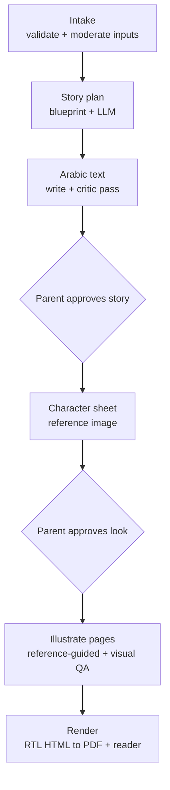
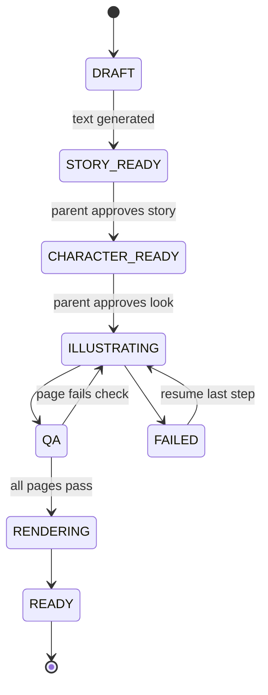

# Personalized Arabic Children's Story SaaS — Solution Plan

Sep 24, 2026 · @hussein fneish

> **Amendment (2026-09-24, product owner):** this ships as a **feature inside Ktab**, not as a
> standalone product. This overrides the "Standalone product, not a feature inside Ktab: decided"
> item under Open decisions and the "standalone product, separate from Ktab" sentence under
> System architecture. Everything else below stands as written. How the Ktab adaptation changes
> the design is recorded in `docs/superpowers/plans/2026-09-24-storybook-00-overview.md`.
>
> **Amendment 2 (2026-09-28, product owner):**
> 1. A parent can **write their own blueprint** (a title and one event per page) instead of choosing a catalogue blueprint, save it, and reuse it.
> 2. The parent can **see the AI-generated text and edit it** (page text and title), and can restore the AI version.
>
> Parent-written blueprints and edits are moderated like dedications. Edits never change illustrations. An edit after the book is ready rebuilds the PDF only. Design and limits: overview decisions D13–D16 and sub-plan `2026-09-28-storybook-08-custom-blueprints-and-text-editing.md`.

## Overview

The platform turns a parent's inputs into a personalized Arabic picture book: 10–15 story pages, each with one illustration and 1–4 sentences.

Two problems decide product quality: keeping the child looking identical across about 17 illustrations, and getting Arabic grammar, tashkeel and typesetting right. The architecture is built around both.

**Each book contains:** a cover, a dedication page, 10–15 story pages and a back page. It is delivered as a 21×21 cm square PDF book, previewed in an RTL web flipbook before download.

## Generation pipeline

Each book moves through eight steps, with two parent approvals placed before any image money is spent.

The story is approved first because text costs cents and images cost dollars.

## Key design decisions

Five decisions separate a product-grade book from a demo.

1. **Blueprint-guided stories, not free-form.** Editors write 10–20 blueprints: a plot skeleton with one beat per page, an age range, a theme and allowed settings. The LLM writes the Arabic text for this child inside that structure. A free-form "surprise me" mode can come later.
2. **No Arabic text inside images.** Image models garble Arabic letters. Illustrations are text-free and leave an empty zone (sky, wall or bottom third) for the text, which is typeset later in an RTL HTML template.
3. **Render with a browser engine.** Headless Chromium through Playwright for Java handles Arabic shaping and bidi correctly. PDFBox, JasperReports and xhtml2pdf handle them poorly, so avoid them here.
4. **Character sheet first.** One approved reference image of the child is passed to every page generation, together with a fixed style reference. This needs an image model that accepts multiple reference images and preserves identity.
5. **Gender is grammar.** Arabic verbs, adjectives and pronouns must agree with the child's gender (ذهبَ / ذهبتْ, شجاع / شجاعة). Gender is a required input, and the critic pass checks agreement on every page.

Image providers are called directly through their APIs from the backend, behind an adapter so models can be swapped. A chat connector such as Higgsfield via MCP cannot drive an unattended SaaS pipeline.

## Inputs

Inputs are mostly structured choices; free text is limited to the dedication because it is the main source of quality and safety problems.

| Input | Required | Why it matters |
| --- | --- | --- |
| Child's name in Arabic script (optional tashkeel) | Yes | Transliteration is ambiguous (Mohamed → محمد or مُحَمَّد), so the parent types it and sees a preview |
| Gender | Yes | Grammatical agreement and illustration |
| Age band (3–5, 6–8, 9–10) | Yes | Sets words per page, vocabulary, sentence length and tashkeel level |
| Appearance via avatar builder: skin tone, hair colour and style, hijab, glasses, eye colour | Yes, unless a photo is uploaded | Drives the character sheet; cheaper, safer and more consistent than photos |
| Photo upload | Optional, premium (in MVP) | Converted to a stylized character, then the photo is deleted |
| Story blueprint or theme (adventure, space, sea, first day of school, Eid, new sibling, honesty) | Yes | Selects the plot skeleton |
| 1–3 interests (football, cats, dinosaurs) | Optional | Woven into scenes |
| One companion: pet or sibling with name and appearance | Optional, max 1–2 | Each extra character makes consistency much harder |
| City or setting (Beirut, Cairo, Riyadh) | Optional | Localized backgrounds |
| Art style from a curated catalogue of 3–4 | Yes | Never free-form; each style is tested and tuned |
| Page count (10, 12 or 15) | Yes | Layout and price |
| Tashkeel level (full, partial, none) | Yes | Readability for the age band; MSA only |
| Dedication from the parent | Optional | Printed on the first page; moderated |
| Language variety: MSA (default), or Lebanese, Egyptian or Gulf dialect | Optional, defaults to MSA | Dialect feels more personal; it has no standard spelling and no tashkeel, so each dialect needs its own style guide and native reviewer |

A 15-page book needs about 17 images: the character sheet, the cover and one per story page.

## System architecture

The platform is a standalone product, separate from Ktab, but built on the same stack: Spring Boot with Spring AI, PostgreSQL with Flyway, and Cloudflare R2.

| Component | Technology | Responsibility |
| --- | --- | --- |
| Frontend | Next.js or similar, RTL-first | Input wizard, avatar builder, approval screens, flipbook reader |
| Core API | Spring Boot + Spring AI, PostgreSQL/Flyway | Accounts, children, books, orders, credits, payments |
| Orchestrator | Book state machine + job table in Postgres, polled by Spring Boot workers | Runs steps, retries, resumes after failure |
| LLM adapter | Claude Sonnet 5 | Story writing, critic pass, visual QA |
| Image adapter | Provider APIs, swappable | Character sheet and page illustrations |
| Render service | Playwright for Java + Chromium container | Page JSON + images → 21×21 cm PDF book |
| Storage | Cloudflare R2, signed URLs | Images, PDFs |

Every AI call logs model, cost and latency. Every step is idempotent, keyed by book + step + page, so a retry never charges twice.

`FAILED` resumes from the last completed step rather than restarting the book.

**Core tables**

- `child_profile`: name, gender, age band, appearance attributes
- `character`: attributes, reference image keys, approval status
- `blueprint`: versioned beats per page, age range, theme
- `book`: snapshot of inputs, `blueprint_version`, `style_id`, status
- `page`: Arabic text, scene spec, current image version
- `page_image`: versions, QA result, cost
- `generation_job`: step, attempts, provider, model, cost, error

## AI steps in detail

Each AI step produces structured output and is checked automatically before the parent sees it.

### Story plan

The LLM receives the blueprint beats and the child's inputs and returns JSON with one entry per page:

- Arabic text for the page
- English scene description (image models follow English better)
- Characters present and their emotion
- Which area of the image to keep empty for text

### Arabic text and critic pass

MSA text is written fully vocalized. If the parent picks a dialect, the text is written in that dialect without tashkeel, following a spelling style guide for that dialect. A second LLM pass acts as an editor and checks:

- Gender agreement on every page
- The child's name spelled consistently
- Word count per page against the age band
- Correct tashkeel (MSA) or consistent dialect spelling
- Nothing inappropriate for children

A failing page is regenerated on its own.

### Illustration and visual QA

Pages are generated in parallel within provider rate limits. A vision model then checks each image:

- Does the child match the reference (hair, skin tone, hijab, clothes)?
- Is there any stray text in the image?
- Are there anatomy defects?
- Is the image safe?

A failing page is retried up to 3 times, then flagged for manual review. Images are generated at 2K (2048 px), about 250 DPI on a 21 cm page: sharp on screen and fine for home printing. No bleed is needed because nothing goes to a professional printer.

### Final review

The parent previews the whole book and can regenerate individual pages a limited number of times.

## Safety and privacy

These are launch requirements, not later improvements, because the product handles children's data and content.

- **Content safety:** moderate every free-text field. The LLM system prompt enforces children's content rules. Default to modest clothing and culturally appropriate content.
- **Religious themes are opt-in:** Eid and Ramadan are separate blueprints, since the target market is diverse.
- **Minimal child data:** first name, age band and appearance only. No surname, school or location beyond the chosen story setting.
- **Photos:** explicit parental consent, deletion right after the character sheet is made, no training on them, encryption while stored, and a published retention policy.
- **Regulation:** check GDPR plus the Gulf data-protection laws (Saudi PDPL, UAE PDPL) for each launch market. Get local legal review before launch.

## Cost per book

AI cost is roughly $1.50–4 per book. These are approximate figures; check them against current provider pricing during the Phase 0 spike.

| Item | Volume per book | Approx. cost (USD) |
| --- | --- | --- |
| LLM: story plan, text, critic pass | a few thousand tokens | < $0.10 |
| Vision QA | \~17 images checked | < $0.15 |
| Images incl. \~30% retries | \~17 images at $0.04–0.15 each | $1.00–3.50 |
| Upscaling, rendering, storage | per book | negligible |

This leaves healthy margins at typical personalized-book prices.

## Roadmap

Phase 0 comes first because character consistency and Arabic quality decide whether the product works at all.

| Phase | Duration (rough) | Scope |
| --- | --- | --- |
| 0 – Spike | \~2 weeks | Run 5 test characters × 15 pages through 3–4 image models; score identity consistency, style stability and cost. A native editor grades the LLM's Arabic and tashkeel on 20 stories. |
| 1 – MVP | \~6–8 weeks, small team | Avatar builder, photo-to-character with consent and auto-deletion, 6–8 blueprints, one art style, MSA plus Lebanese, Egyptian and Gulf dialects, both approval gates, automatic QA, web reader and PDF, payments |
| 2 | after MVP | More art styles, per-page editing, narrated read-along with word highlighting (reuses the Arabic TTS provider work and its timestamps) |
| 3 | later | Sequels reusing the same character, books with siblings, more dialects, B2B licensing for schools and publishers |

## Open decisions

These need an answer before or during Phase 1.

- [x] Image model: begin with Nano Banana 2: decided
- [x] Orchestration: plain job table with workers: decided
- [x] Launch markets, and the payment provider that covers them
- [x] Retail price per book (digital and print)
- [x] Photo upload in the MVP: decided yes
- [x] Language: MSA by default, dialect when the parent asks for it: decided
- [x] Output: PDF book only, no print-on-demand; 21×21 cm square: decided
- [x] Standalone product, not a feature inside Ktab: decided
- [x] Launch dialects: Lebanese, Egyptian and Gulf: decided
- [x] Find a native reviewer and write a spelling style guide for each launch dialect

Dialect style guides (drafts, to be checked by a native speaker): see the Lebanese, Egyptian and Gulf style guides at the end of this file.

### Image model shortlist

Decision: begin with Nano Banana 2. Nano Banana Pro is the fallback for pages that fail QA; FLUX.2 Pro and GPT Image 2.5 stay as alternatives if Phase 0 shows consistency problems.

| Model | Role | Character references per call | Price per image (standard API) | Notes |
| --- | --- | --- | --- | --- |
| [Nano Banana 2](https://www.aifreeapi.com/en/posts/nano-banana-2-pricing-api) (`gemini-3.1-flash-image`) | Primary | Up to 4 | $0.067 at 1K, $0.101 at 2K; Batch about half | Listed as a preview model; confirm SLA before launch |
| [Nano Banana Pro](https://www.aifreeapi.com/en/posts/nano-banana-2-pricing-api) (`gemini-3-pro-image`) | Fallback for pages that fail QA | Up to 5 | $0.134 at 1K or 2K; Batch $0.067 | About 2× the cost of Nano Banana 2 |
| [FLUX.2 Pro](https://developer.puter.com/tutorials/flux-api-pricing/) | Benchmark candidate | Up to 8 reference images | From $0.03 text-to-image, from $0.045 editing; input images billed extra | Separate roles for identity, pose, clothing and scene; no batch discount |
| [GPT Image 2.5](https://tech-insider.org/consistent-ai-character-generator-test-2026/) | Benchmark candidate | Via the image edit endpoint | Confirm on OpenAI's pricing page | Near the top of the Artificial Analysis editing leaderboard, Sept 2026 |

At 2K on Nano Banana 2, a 17-image book costs about $1.70 before retries.

No model guarantees 1:1 identity, so the visual QA and retry loop stays whichever model wins.

**How each page is called:** the approved character sheet (front and 3/4 view), one fixed style reference, the companion's sheet if any, and the English scene prompt. Generate at 2K. The provider adapter keeps switching models a configuration change.

**Cost lever:** Google's Batch mode halves the price for work that can wait. It only fits if you offer a cheaper, slower delivery option; instant books use standard mode.

Sources (opened 2026-09-24; Google prices are a March 2026 snapshot, re-check the official pricing page before launch):

- [Best AI Models for Character Consistency (QuestStudio)](https://queststudio.io/blog/best-ai-models-for-character-consistency): reference limits, no 1:1 identity guarantee
- [Nano Banana 2 API Pricing (AI Free API)](https://www.aifreeapi.com/en/posts/nano-banana-2-pricing-api): Google standard and Batch rates, model IDs, preview status
- [FLUX API Pricing, Sep 2026 (Puter)](https://developer.puter.com/tutorials/flux-api-pricing/): FLUX.2 rates, billed input images, no batch discount
- [Consistent AI Character Generator test (Tech Insider)](https://tech-insider.org/consistent-ai-character-generator-test-2026/): GPT Image 2.5 leaderboard position, Nano Banana 2 prices as of Sept 2026

---

# Lebanese dialect style guide

These are the rules the story LLM and the critic pass follow when a parent picks Lebanese. Draft: a native Lebanese speaker should check it before launch.

## Spelling rules

1. No tashkeel.
2. Word-final ة stays ة, never ه: حلوة، شجرة، شنطة.
3. ق is always written ق, even where it is pronounced as a hamza: قال, not آل.
4. Everyday dialect words use their usual Lebanese spelling (كتير، تلاتة، هيك). Words shared with MSA keep the MSA spelling (ثلج، ذهب، ظهر).
5. The "his / him" suffix is written ـو: بيتو، بدو، معو. "Her" stays ـها: بيتها.
6. The child's name is written exactly as the parent typed it.
7. Speech goes after a colon, in «quotation marks». Use Arabic punctuation: ، ؟ !
8. Numbers are written as words.
9. No Latin letters, and no French or English loanwords when an Arabic word exists: شكرا, not مرسي.
10. No slang or insults; nothing a parent would not read aloud to a young child.

## Word and grammar choices

Where Lebanese has several spellings or variants, use the first column only.

| Meaning | Write | Don't write |
| --- | --- | --- |
| this (m / f) | هيدا / هيدي | هادا، هاي |
| these | هودي | هول |
| what | شو | إيش |
| why / where / how | ليش / وين / كيف | — |
| when | إيمتى | امتى |
| now | هلق | هلأ |
| here / there | هون / هونيك | هنا |
| like this | هيك | هيكي |
| I / you / he want(s) | بدي / بدك / بدو | بده |
| there is / there isn't | في / ما في | فيه |
| a lot, very | كتير | كثير |
| good | منيح | — |
| yes / no | إيه / لأ | اي، لا |
| come (m / f) | تعا / تعي | تعال |
| grandma / grandpa | تيتا / جدو | ستي |
| present tense | بـ + verb: بيلعب، بتلعب، بلعب | — |
| we (present) | منـ + verb: منلعب | بنلعب |
| future | رح + verb: رح نلعب | راح (it also means "went") |
| is doing right now | عم + verb: عم يلعب | عام |
| not (verb) | ما + verb: ما بعرف | — |
| not (adjective or noun) | مش: مش تعبان | مو |

## Example

The same story lines in MSA and in Lebanese, following the rules above.

| MSA | Lebanese |
| --- | --- |
| فتح سامي الباب وقال: «هيا نلعب في الخارج!» | سامي فتح الباب وقال: «يلا نلعب برا!» |
| قالت ماما: «سنتغدى الآن، ثم نلعب.» | ماما قالت: «هلق رح نتغدى، وبعدين منلعب.» |
| كانت القطة تنام تحت الشجرة. | البسينة كانت عم تنام تحت الشجرة. |
| أريد أن ألعب معك كثيرًا. | بدي إلعب معك كتير. |

---

# Egyptian dialect style guide

These are the rules the story LLM and the critic pass follow when a parent picks Egyptian. Draft: a native Egyptian speaker should check it before launch.

## Spelling rules

1. No tashkeel.
2. Word-final ة stays ة, never ه: حلوة، شجرة، شنطة.
3. ق is always written ق, even where it is pronounced as a hamza: قال, not آل. One fixed exception: أوي ("very"), because قوي reads as "strong".
4. Everyday dialect words use their usual Egyptian spelling (كتير، تلاتة، ده). Words shared with MSA keep the MSA spelling (ثلج، ذهب، ظهر).
5. The "his / him" suffix is written ـه: بيته، معاه. "Her" is ـها: بيتها.
6. The child's name is written exactly as the parent typed it.
7. Speech goes after a colon, in «quotation marks». Use Arabic punctuation: ، ؟ !
8. Numbers are written as words.
9. No Latin letters, and no English or French loanwords when an Arabic word exists: شكرا, not ميرسي.
10. No slang or insults; nothing a parent would not read aloud to a young child.

## Word and grammar choices

Where Egyptian has several spellings or variants, use the first column only.

| Meaning | Write | Don't write |
| --- | --- | --- |
| this (m / f) | ده / دي | دا، ديه |
| these | دول | — |
| what | إيه | إيش، شو |
| why / where / how | ليه / فين / إزاي | ليش، وين، كيف |
| when | إمتى | امتى |
| now | دلوقتي | دلوقت |
| here / there | هنا / هناك | هون |
| like this | كده | كدا |
| want (m / f / plural) | عايز / عايزة / عايزين | عاوز |
| there is / there isn't | فيه / مفيش | ما فيش |
| a lot | كتير | كثير |
| very | أوي | قوي |
| good | كويس | — |
| look! | بص | — |
| yes / no | أيوه / لأ | ايوة، لا |
| come (m / f) | تعالى / تعالي | تعال |
| grandma / grandpa | تيتة / جدو | — |
| present tense | بـ + verb: بيلعب، بتلعب، بلعب | — |
| we (present) | بنـ + verb: بنلعب | منلعب |
| future | هـ + verb: هيلعب، هنلعب | حـ: حيلعب |
| is doing right now | بـ + verb, same as present: بيلعب دلوقتي | عم |
| not (verb) | ما … ش, with ما separate: ما لعبش، ما بيحبش | ملعبش |
| not (adjective, future) | مش: مش تعبان، مش هنلعب | مو |
| my (possession) | attached suffix: كتابي | الكتاب بتاعي, except for emphasis |

## Example

The same story lines in MSA and in Egyptian, following the rules above.

| MSA | Egyptian |
| --- | --- |
| فتح سامي الباب وقال: «هيا نلعب في الخارج!» | سامي فتح الباب وقال: «يلا نلعب بره!» |
| قالت ماما: «سنتغدى الآن، ثم نلعب.» | ماما قالت: «دلوقتي هنتغدى، وبعدين نلعب.» |
| كانت القطة تنام تحت الشجرة. | القطة كانت نايمة تحت الشجرة. |
| أريد أن ألعب معك كثيرًا. | أنا عايز ألعب معاك كتير. |

---

# Gulf dialect style guide

These are the rules the story LLM and the critic pass follow when a parent picks Gulf. Gulf Arabic varies by country, so this guide uses one broad, Saudi-leaning style. Draft: a native Gulf speaker should check it before launch.

## Spelling rules

1. No tashkeel.
2. Word-final ة stays ة, never ه: حلوة، شجرة، شنطة.
3. ث، ذ and ظ are written as in MSA, since Gulf speech keeps these sounds: كثير، هذا.
4. ق is always written ق, even where it is pronounced "g": قال, never گال or ڨال.
5. ك is always written ك, even where it is pronounced "ch": عليك, not عليج or عليچ; كذا, not جذي.
6. ج is always written ج, even where it is pronounced "y": جدة، رجال, not يدة، ريال.
7. The "his / him" suffix is written ـه: بيته، معه. "Her" is ـها: بيتها.
8. The child's name is written exactly as the parent typed it.
9. Speech goes after a colon, in «quotation marks». Use Arabic punctuation: ، ؟ !
10. Numbers are written as words.
11. No Latin letters, and no English loanwords when an Arabic word exists: شكرا, not ثانكيو.
12. No slang or insults; nothing a parent would not read aloud to a young child.

## Word and grammar choices

Where Gulf Arabic has several variants, use the first column only.

| Meaning | Write | Don't write |
| --- | --- | --- |
| this (m / f) | هذا / هذي | ذا، هاذا |
| these | هذولا | هذول |
| what | وش | شنو، شو، إيش |
| why / where | ليش / وين | — |
| how | كيف | شلون |
| when | متى | — |
| now | الحين | الحينه |
| here / there | هنا / هناك | هني |
| like this | كذا | جذي، جي |
| want (I / you / he) | أبي / تبي / يبي | أبغى، أبا |
| there is / there isn't | فيه / ما فيه | — |
| a lot | كثير | وايد |
| very | مرة | وايد |
| good | زين | — |
| yes / no | إيه / لا | — |
| come (m / f) | تعال / تعالي | — |
| grandma / grandpa | جدة / جد | يدة |
| present tense | plain verb, no prefix: يلعب، تلعب، ألعب | بيلعب (in Gulf this means "will play") |
| future | بـ + verb: بنلعب، بيروح | — |
| is doing right now | قاعد / قاعدة + verb: قاعد يلعب | عم |
| not (verb) | ما + verb: ما أدري | — |
| not (adjective or noun) | مو: مو تعبان | مب، مش |

For a UAE or Kuwait version later, swap a few words: وش becomes شو (UAE) or شنو (Kuwait), أبي becomes أبا (UAE), كيف becomes شلون (Kuwait), and كثير becomes وايد.

## Example

The same story lines in MSA and in Gulf, following the rules above.

| MSA | Gulf |
| --- | --- |
| فتح سامي الباب وقال: «هيا نلعب في الخارج!» | سامي فتح الباب وقال: «يلا نلعب برا!» |
| قالت ماما: «سنتغدى الآن، ثم نلعب.» | ماما قالت: «الحين بنتغدى، وبعدين نلعب.» |
| كانت القطة تنام تحت الشجرة. | القطوة كانت نايمة تحت الشجرة. |
| أريد أن ألعب معك كثيرًا. | أبي ألعب معك كثير. |
